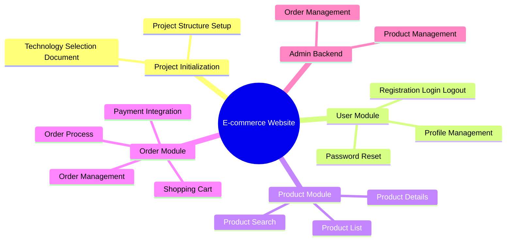

# Programmer Role Transformation: From Coder to AI Commander


## The AI Era Has Arrived: 2025-2026 Programming Paradigm Revolution

2025 is called the "AI Agent Programming Year." AI programming tools represented by Claude Code, Cursor, and Windsurf have moved beyond simple code completion to become true **intelligent agents**.

This is not an upgrade of tools, but a **fundamental transformation of the programming paradigm**.

### Evolution of Three Generations of AI Programming Tools

| Era | Representative Tools | Interaction Mode | Core Capabilities |
|------|---------|---------|---------|
| **First Generation** (2021-2023) | GitHub Copilot | Code Completion | Single-line/multi-line code suggestions |
| **Second Generation** (2023-2024) | ChatGPT, Claude | Conversational Programming | Code generation, explanation, debugging |
| **Third Generation** (2025-Present) | Claude Code, Cursor Agent | Agent-based Programming | Autonomous planning, execution, iteration |

### What is Agentic Coding?

Agentic Coding is a completely new programming paradigm that emerged in 2025. AI is no longer just an assistant tool, but can:

- **Autonomous Planning**: Decompose complex tasks into executable steps
- **Tool Usage**: Call external tools like file systems, databases, and APIs
- **Multi-round Iteration**: Self-correct based on execution feedback
- **Context Awareness**: Understand entire project structure and dependencies

**Traditional Programming**: Programmer → Write Code → Run Tests → Debug Fix

**Agentic Programming**: Programmer → Define Specification → AI Agent → Autonomous Execution → Review Acceptance

## What is an AI Commander?

An AI Commander does not mean not writing code anymore, but a **fundamental transformation of role**:

### Work Content Comparison

| Dimension | Traditional Programmer | AI Commander |
|------|-----------|----------|
| **Core Output** | Code | Specification (Spec) + Review |
| **Work Focus** | Implementation Details | Requirements Definition & Architecture Design |
| **Collaboration Mode** | Solo Work | Orchestrating Multiple AI Agents |
| **Thinking Mode** | Linear Execution | Iterative Optimization |
| **Value Reflection** | Lines of Code | Problem Solving Quality |

### Core Responsibilities of an AI Commander

1. **Requirements Translator**: Transform vague business requirements into precise AI-executable specifications
2. **Architecture Designer**: Design system structure, define module boundaries
3. **Quality Gatekeeper**: Review AI-generated code to ensure security and best practices
4. **AI Trainer**: Optimize prompts through feedback to improve AI output quality

## Key Technology Stack 2025-2026

### 1. MCP (Model Context Protocol)

MCP is the "USB-C interface" for AI, open-sourced by Anthropic in late 2024. It enables AI to connect standardized to:

- **File System**: Read/write local files, traverse directories
- **Database**: Execute SQL queries, manage data
- **Browser**: Automated testing, web scraping
- **Development Tools**: Git operations, build and deploy
- **Custom Services**: Any tool you develop

```typescript
// MCP Tool Example: File System Tool
{
  name: "read_file",
  description: "Read file content",
  input_schema: {
    path: "string",      // File path
    offset: "number?",   // Starting line (optional)
    limit: "number?"     // Number of lines to read (optional)
  }
}
```

### 2. Agent Skills

At the end of 2025, Agent Skills became an open specification, with mainstream tools already supporting it:

- **Claude Code**: Native support, managed through `.claude/skills/` directory
- **Cursor**: Configured via `.cursor/skills/`
- **VS Code**: GitHub Copilot extension support
- **Windsurf**: Built-in Skills marketplace

Skills give AI professional capabilities in specific domains, for example:

```yaml
# React Development Skill
name: react-expert
description: React and TypeScript development expert
triggers:
  - file_pattern: "*.tsx"
  - file_pattern: "*.ts"
prompt: |
  You are a React expert. Please follow these specifications:
  1. Use functional components and Hooks
  2. Prefer TypeScript strict mode
  3. Component naming uses PascalCase
  4. Use Zod for runtime type validation
```

### 3. Spec-Driven Development (SDD)

SDD (Spec-driven Development) is the core methodology of the AI era.

> "Specifications are more important than code. Senior developers should spend 80% of their time writing specs and 20% of their time reviewing code." -- Sean Grove, OpenAI

SDD Workflow:

```
1. Requirements Analysis → 2. Write Spec → 3. AI Generates Code → 4. Review & Accept → 5. Iterate & Optimize
    ↑___________________________________________________________↓
```

**Why are Specifications so Important?**

- **AI's Understanding Foundation**: AI doesn't have "mind reading," Spec is its only source of information
- **Quality Anchor**: Clear acceptance criteria, avoiding repeated rework
- **Common Language for Teams**: Product managers, developers, and AI collaborate based on the same document

## Core Competency Model for Commanders

To become an excellent AI Commander, you need to build the following competencies:

### 1. Requirements Analysis Ability

Transform vague business requirements into clear AI-executable instructions.

**Example**:

> ❌ **Vague Requirement**: "Build a user login feature"

> ✅ **Clear Requirement**:
> - Support username/password login
> - Passwords must be encrypted storage (bcrypt)
> - Return JWT Token upon successful login
> - Token validity: 24 hours
> - Error messages: Username does not exist / Incorrect password
> - Support "Remember Me" function (7-day免登录)

### 2. Specification Writing Ability

Master SDD methodology and write high-quality technical specifications.

### 3. Task Decomposition Ability

Decompose complex systems into AI-executable sub-tasks.

**Example**: E-commerce Website Development



### 4. Prompt Engineering Ability


The art of efficient communication with AI. Core principles:

- **Be Specific**: Clear instructions are better than vague descriptions
- **Provide Context**: Background information helps AI understand intent
- **Specify Format**: Define the structure and style of output
- **Iterate and Optimize**: Continuously improve prompts based on feedback

### 5. Code Review Ability

Review AI-generated code, focusing on:

- **Security**: SQL injection, XSS, sensitive information leakage
- **Performance**: Algorithm complexity, database query optimization
- **Maintainability**: Code structure, naming conventions, comments
- **Correctness**: Boundary conditions, exception handling, business logic

## Learning Path and Goals

### Learning Path for This Course


```
Stage One: Mindset Upgrade (Chapter 1)
├── 1.1 Role Transformation: From Coder to Commander
├── 1.2 AI Capability Boundaries: What It Can vs Cannot Do
└── 1.3 Tool Selection: Claude Code vs Cursor vs Others

Stage Two: Specification-Driven (Chapter 2)
├── 2.1 Importance of Specifications
├── 2.2 How to Write Good Technical Specifications
├── 2.3 Specification Templates and Cases
└── 2.4 Practice: Develop a Feature Using SDD

Stage Three: Prompt Engineering (Chapter 3)
├── 3.1 Prompt Engineering Basics
├── 3.2 Advanced Prompt Techniques
├── 3.3 Context Engineering
└── 3.4 Practice: Optimize Complex Prompts

Stage Four: Task Decomposition (Chapter 4)
├── 4.1 Task Decomposition Principles
├── 4.2 Workflow Design
└── 4.3 Practice: Decompose Complex Projects

Stage Five: Advanced Topics (Chapters 5-9)
├── 5. Agent Skills Development
├── 6. Multi-Agent Collaboration
├── 7. Code Review and Quality Control
├── 8. Performance Optimization and Debugging
└── 9. Practical Projects
```

### Course Goals

Through this course, you will:

- ✅ Master SDD (Spec-driven Development) methodology
- ✅ Write specification documents that enable AI to execute accurately
- ✅ Master core techniques of prompt engineering
- ✅ Design custom Agent Skills
- ✅ Build Multi-Agent collaboration systems
- ✅ Establish a complete AI programming workflow

## Claude Code Best Practices (Official Recommendations)

According to Claude Code Best Practices officially published by Anthropic, here are the core techniques for efficient use of Claude Code:

### 1. Common Workflow Patterns

**Explore-Plan-Code-Commit Pattern:**

1. **Explore**: Let Claude understand the existing codebase
2. **Plan**: Discuss implementation plans and determine technical approach
3. **Code**: Implement step by step, each step confirmed before proceeding
4. **Commit**: Submit after code review passes

**Test-Driven Development Pattern:**

1. **Write Tests**: Define expected behavior first
2. **Run Tests**: Confirm tests fail
3. **Implement Features**: Make tests pass
4. **Refactor and Optimize**: Improve code quality

### 2. Prompt Techniques

**✅ Effective Prompting:**

- **Be Specific**: "Add input validation" → "Add format validation for the email field, show red error message on error"
- **Provide Context**: "Based on the architecture we just discussed..."
- **Break into Steps**: "First create the interface, then implement the logic, finally add tests"
- **Use Examples**: "Something like this: [code example]"

**❌ Avoid These Prompting Methods:**

- Too vague: "Fix bug"
- Asking too much at once: "Refactor the entire project and add new features"
- No context: Directly asking to modify unrelated code

### 3. Code Review Strategy

Code generated by Claude Code should undergo the following checks:

- **Security Check**: Any SQL injection or XSS risks?
- **Boundary Conditions**: Are null values and exceptional inputs handled?
- **Performance Considerations**: Is algorithm complexity reasonable?
- **Code Style**: Does it conform to project conventions?

### 4. Mindset for Collaborating with Claude

- **Iterative**: Don't expect perfection at once, optimize through multiple rounds of dialogue
- **Proactive Guidance**: Correct misunderstandings from Claude in a timely manner
- **Maintain Skepticism**: Always verify critical code
- **Learn and Summarize**: Record effective prompt patterns to form your own technique library

## Start Your Journey

In the following courses, we will start from the basics and progressively learn all these skills.

**First Step**: Understand AI's capability boundaries, knowing when to use AI and when human intervention is necessary.

---

**Next**: Learn [1.2 What AI Can vs Cannot Do](/tutorial/L1-2)

## Reference Resources

- [Claude Code Documentation - Anthropic](https://docs.anthropic.com/en/docs/agents-and-tools/claude-code/overview)
- [Google Prompt Engineering Guide](https://ai.google.dev/gemini-api/docs/prompting-intro)
- [Spec-Driven Development - Al Harris](https://specdriven.org)
- [MCP Documentation](https://modelcontextprotocol.io/introduction)
- [Agent Skills Specification](https://github.com/anthropics/skills)
