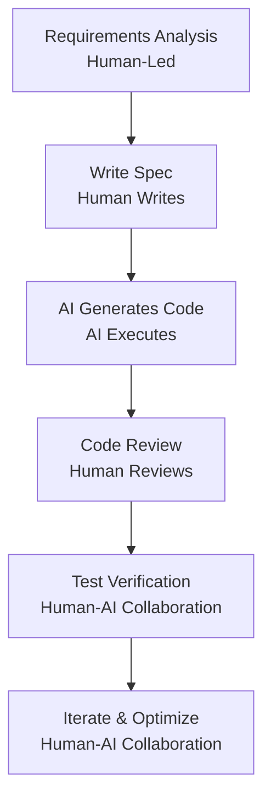
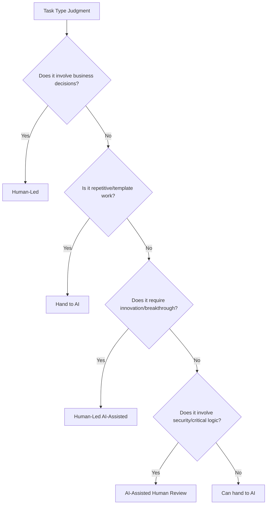

# What AI Can vs Cannot Do


## Understanding AI's Capability Boundaries

Understanding AI's capability boundaries is a prerequisite for becoming an excellent commander. **Over-reliance on or excessive suspicion of AI will affect efficiency**. This chapter will deeply analyze AI's capability boundaries in the programming field, helping you establish correct human-machine collaboration awareness.

## Areas Where AI Excels

### 1. Code Generation and Implementation

AI performs excellently in code generation, especially:

**✅ Scenarios Where AI Excels:**

- **Function and Class Implementation**: Generate specific implementations based on docstrings
- **Common Algorithms**: Sorting, searching, data structure operations
- **Template Code**: CRUD operations, API routes, component templates
- **Code Translation**: Conversion between different programming languages
- **Regular Expressions**: Generate matching patterns based on descriptions
- **SQL Queries**: Generate database queries based on requirements

**Example:**
```python
# Input: "Write a function to calculate the nth term of the Fibonacci sequence, with time complexity O(log n)"
# AI can generate matrix fast power or closed-form implementation

def fibonacci(n):
    """Calculate Fibonacci sequence using matrix fast power"""
    if n <= 0:
        return 0
    elif n == 1:
        return 1
    
    def multiply(F, M):
        x = F[0][0] * M[0][0] + F[0][1] * M[1][0]
        y = F[0][0] * M[0][1] + F[0][1] * M[1][1]
        z = F[1][0] * M[0][0] + F[1][1] * M[1][0]
        w = F[1][0] * M[0][1] + F[1][1] * M[1][1]
        F[0][0], F[0][1], F[1][0], F[1][1] = x, y, z, w
    
    def power(F, n):
        M = [[1, 1], [1, 0]]
        for _ in range(2, n + 1):
            multiply(F, M)
    
    F = [[1, 1], [1, 0]]
    power(F, n - 1)
    return F[0][0]
```

### 2. Knowledge Q&A and Explanation

AI has extensive programming knowledge:

- **Concept Explanation**: Design patterns, algorithm principles, framework mechanisms
- **Technology Comparison**: React vs Vue, SQL vs NoSQL
- **Best Practices**: Code style, security standards, performance optimization
- **Error Diagnosis**: Provide solutions based on error messages

### 3. Code Review and Optimization

AI can assist with:

- **Bug Detection**: Null pointers, array out of bounds, resource leaks
- **Security Audit**: SQL injection, XSS, sensitive information leakage
- **Performance Analysis**: Time/space complexity, N+1 queries
- **Readability Improvement**: Naming suggestions, refactoring suggestions

### 4. Documentation and Testing

- **API Documentation**: Generate interface documentation from code
- **README Writing**: Project introduction, installation instructions
- **Unit Testing**: Generate test cases based on functions
- **Comment Generation**: Explain complex logic

## AI's Limitations

### 1. Hallucination Problem

> **Hallucination** is one of the biggest technical bottlenecks in generative AI. When a model cannot find the exact answer, it will "fabricate" information that looks reasonable but is actually completely wrong.

**Common Manifestations:**
- Generating non-existent APIs or functions
- Providing incorrect version information
- Fabricating non-existent libraries or tools

**Example:**
```python
# ❌ AI may generate incorrect code
import tensorflow as tf

# Suppose user asks: "New features of TensorFlow 3.0"
# AI may fabricate non-existent APIs
model = tf.keras.Sequential3D()  # Non-existent class
model.compile(optimizer='adam5')   # Non-existent optimizer
```

**Coping Strategies:**
- Always verify APIs and libraries provided by AI
- Check official documentation to confirm version information
- Test critical code in practice

### 2. Context Window Limitations

AI models have **context window (Context Window) limitations**, meaning the amount of text they can process at once:

| Model | Context Window | Approximate Code Volume |
|------|-----------|-----------|
| GPT-4o | 128K tokens | ~300 pages of code |
| Claude 3 Sonnet | 200K tokens | ~500 pages of code |
| Claude 3.5 Sonnet | 200K tokens | ~500 pages of code |

> Note: "Page" is estimated at approximately 50 lines of code per page

**Impact:**
- Cannot understand an entire large project at once
- Complex cross-file dependencies are easily overlooked
- Early context in long conversations may be "forgotten"

**Coping Strategies:**
- Use RAG (Retrieval Augmented Generation) to provide relevant context
- Modular design to reduce single-file complexity
- Proactively provide key contextual information

### 3. Understanding Incomplete Requirements

**If you don't know yourself what you want, AI cannot help you achieve it.**

AI excels at executing clear instructions but is not good at:
- Filling in vague requirement gaps
- Predicting unspecified business rules
- Understanding implied context

**Example Comparison:**

```
❌ Vague Requirement:
"Build a user system"
→ AI might generate: Simple login registration
→ Actually needed: OAuth, permission management, audit logs

✅ Clear Requirement:
"Implement a user authentication system, requirements:
- Support email/phone registration
- Integrate Google OAuth
- Role permission management (admin/user/guest)
- Operation audit logs
- JWT Token authentication"
```

### 4. Complex Logic Across Files

AI is good at handling logic within a single file, but:
- Cross-module dependency management requires human oversight
- Architecture-level decisions require human experience
- Global refactoring requires overall planning

### 5. Business Decisions and Innovation

AI cannot replace human judgment in the following areas:

| Area | Reason |
|------|------|
| **Product Direction** | Requires market insight and user understanding |
| **Technology Selection** | Requires weighing team capabilities, ecosystem, and long-term maintenance |
| **Architecture Design** | Needs to consider scalability, performance, and cost |
| **Innovation Solutions** | AI is based on existing data; true innovation requires human thinking |

## New Boundaries of AI Programming in 2025

### Continuously Expanding Capabilities

With technological progress, AI's capability boundaries are expanding:

- **Agent Mode**: AI can autonomously plan and execute multi-step tasks
- **Tool Calling**: Connect external systems and tools through MCP
- **Multimodal**: Understand images, charts, and even video content
- **Long Context**: Claude 3 supports 200K tokens, equivalent to an entire book

### Challenges That Still Exist

- **Complex Reasoning**: Multi-step logical reasoning may still be error-prone
- **Common Sense Understanding**: Lacks human common sense and intuition
- **Emotional Intelligence**: Cannot understand subtle emotions and social context
- **Value Judgment**: Cannot make decisions involving ethics and values

## Best Practice: Human-Machine Collaboration Model

### Golden Rule

| Responsibility | Human Responsible | AI Responsible |
|------|---------|---------|
| **Core Work** | Define requirements and specifications | Generate code implementation |
| **Decision Making** | Make key decisions | Draft documents and tests |
| **Design Review** | Architecture design and review | Code review suggestions |
| **Edge Cases** | Handle edge cases | Answer common questions |
| **Innovation Breakthrough** | Innovate and breakthrough | Repetitive work |

### Collaboration Process Suggestions



### Decision Tree: When to Use AI?



## Summary: Human-Machine Division Comparison Table

| Task Type | Recommended Approach | Reason |
|---------|---------|------|
| Repetitive code | ✅ Let AI do | Improve efficiency, reduce errors |
| Template implementation | ✅ Let AI do | AI is good at pattern matching |
| Document drafting | ✅ Let AI do | Quick generation, human polish |
| Bug fixing | ⚠️ AI-assisted | AI provides suggestions, human verifies |
| Code explanation | ✅ Let AI do | AI has broad knowledge |
| Requirements definition | ❌ Do it yourself | Requires business understanding |
| Key decisions | ❌ Do it yourself | Requires experience and judgment |
| Architecture design | ❌ Do it yourself | Requires global perspective |
| Security audit | ⚠️ AI-assisted | AI finds clues, human decides |
| Innovative thinking | ❌ Do it yourself | AI is based on existing data |

## Context Engineering

> Context Engineering is a new concept proposed in 2025, referring to **how to effectively provide contextual information to AI** to achieve better output quality.

### Why is Context so Important?

AI models have no memory; each interaction is independent. It can only understand the task based on the context you provide.

**The quality of context directly determines the quality of output.**

### Three Levels of Context Engineering

#### 1. Immediate Context

Information provided in the current dialogue:

> ❌ **Inefficient**:
> "Fix this bug"

> ✅ **Efficient**:
> "In the login function of src/utils/auth.ts file,
> when the user enters the wrong password, there is no proper error message.
> Expected behavior: Display 'Incorrect password, please try again'.
> Current behavior: No prompt, page freezes."

#### 2. Session Context

Information accumulated throughout the entire dialogue history:

**Tip 1**: Provide project background at the start of the conversation
> "This is a React + TypeScript project, using Zustand for state management,
> React Query for data fetching."

**Tip 2**: Regularly summarize discussed content
> "Based on our previous discussion, the approach is:
> 1. Use JWT for authentication
> 2. Refresh Token mechanism
> 3. Store in httpOnly cookie
> Please implement according to this approach."

**Tip 3**: Reference previous decisions
> "Following the design pattern we established in step 3..."

#### 3. External Context

Context provided through RAG (Retrieval Augmented Generation) or MCP:

**RAG Example**:
- Vector database stores semantic information of code base
- Automatically retrieve relevant code snippets
- Dynamically inject into prompts

**MCP Example**:
- Read project configuration files
- Query database schemas
- Fetch API documentation

### Context Engineering Best Practices

**1. Provide Information in Layers**

1. **First Layer**: Project background (what to do)
2. **Second Layer**: Tech stack (what to use)
3. **Third Layer**: Specific requirements (what the result should look like)
4. **Fourth Layer**: Constraints (limitations)

**2. Use Structured Format**
```markdown
## Task
Implement user login feature

## Background
This is an e-commerce website that needs to support email and password login

## Technical Requirements
- React + TypeScript
- Use React Hook Form to handle forms
- Use Zod for form validation

## Acceptance Criteria
- [ ] Email format validation
- [ ] Password strength check
- [ ] Error message display
- [ ] Login state persistence

## References
- Design draft: /design/login.png
- API documentation: /docs/auth.md
```

**3. Proactively Manage Context Length**

When approaching context limits:
- Summarize previous discussions and start a new session
- Use files to store intermediate results
- Handle complex tasks in modules

### Relationship Between Context and Prompt Engineering

```
Prompt Engineering: How to ask questions
    ↓
Context Engineering: What information to provide
    ↓
Output Quality: AI's response
```

The two complement each other:
- **Good prompt** + **Insufficient context** = AI guesses, may be wrong
- **Average prompt** + **Rich context** = AI understands accurately
- **Good prompt** + **Rich context** = Best results

## Suggestions for AI Commanders

1. **Maintain critical thinking**: Don't blindly trust AI output
2. **Establish verification mechanisms**: Critical code must be tested and reviewed
3. **Continuous learning**: Keep up with the latest developments in AI capabilities
4. **Accumulate experience**: Record cases of AI success and failure
5. **Human-machine complementarity**: Leverage each other's strengths to form a collaboration loop
6. **Invest in context**: Spend time preparing high-quality context, the回报 is huge

---

**Next**: Learn [1.3 Comparison of Mainstream AI Programming Tools](/tutorial/L1-3)

## Reference Resources

- [The Jagged Frontier of AI Capabilities - HBR](https://hbr.org)
- [AI Hallucination: Causes and Mitigation - arXiv](https://arxiv.org)
- [Context Engineering for LLMs - Anthropic](https://www.anthropic.com)
- [When to Use AI vs Human Judgment - MIT Sloan](https://mitsloan.mit.edu)
