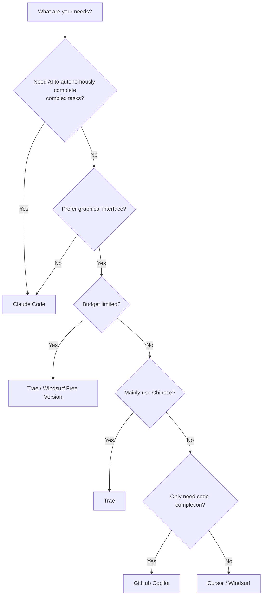
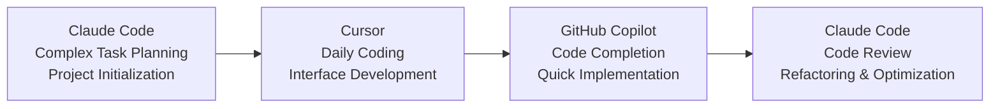

# Comparison of Mainstream AI Programming Tools


## AI Programming Tools Ecosystem (2025-2026)

2025 is a year of explosion for AI programming tools. From code completion to intelligent agents, from single functions to complete workflows, AI programming tools are reshaping developers' daily work methods.

This chapter will deeply compare mainstream tools to help you choose the AI programming assistant that best suits you.

## Deep Comparison of Mainstream Tools

### 1. Claude Code ⭐ Recommended

**Positioning**: Terminal-based AI programming assistant from Anthropic, currently the most advanced Agent tool

**Core Features**:
- **Agent Mode**: AI can autonomously plan, execute, and iterate to complete complex tasks
- **Tool Calling**: Native support for file system, command line, code editing, and other tools
- **Native MCP**: Deep integration of Model Context Protocol
- **Long Context**: Supports 200K tokens, can handle large codebases

**Pros vs Cons**:

| ✅ Pros | ❌ Cons |
|--------|---------|
| Strongest Agent capabilities | Need to learn CLI commands |
| Can autonomously execute complete development workflows | No graphical interface |
| Excellent tool calling capabilities | Somewhat steep learning curve for beginners |
| Deep optimization with Claude model | |
| Supports multi-round dialogue and context | |

**Applicable Scenarios**:
- Complex project development
- Automated script writing
- Large codebase refactoring
- Tasks requiring multi-step coordination

**Typical Workflow**:
```bash
# 1. Start Claude Code
$ claude

# 2. Describe requirements
> Help me create a React project with user login functionality

# 3. AI autonomously executes
# - Create project structure
# - Install dependencies
# - Write code
# - Run tests
# - Commit code
```

---

### 2. Cursor

**Positioning**: AI-first code editor, deeply integrated AI into every aspect of the IDE

**Core Features**:
- **Tab Completion**: Context-aware intelligent code completion
- **Chat Mode**: Sidebar dialogue for questions anytime
- **Agent Mode**: Supports multi-file editing and command execution
- **Composer**: AI-assisted multi-file editing

**Pros vs Cons**:

| ✅ Pros | ❌ Cons |
|--------|---------|
| Compatible with VS Code ecosystem | Relatively new, some features unstable |
| User-friendly interface, low learning curve | Agent capabilities not as strong as Claude Code |
| Fast Tab completion speed | Performance may degrade on large projects |
| Supports multiple AI models | Requires paid subscription |
| Deep code understanding | |

**Applicable Scenarios**:
- Daily development work
- Scenarios requiring graphical interface
- Team collaboration projects
- Rapid prototyping

**Pricing**:
- Free version: 2000 code completions per month
- Pro version: $20/month, unlimited completions + advanced features

---

### 3. Windsurf

**Positioning**: Next-generation AI editor launched by Codeium, focusing on Flow mode

**Core Features**:
- **Flow Mode**: AI real-time predicts next operations
- **Cascade**: Multi-step AI workflow
- **Multi-file Editing**: Handle multiple files simultaneously
- **Deep Context Understanding**: Understands project structure and dependencies

**Pros vs Cons**:

| ✅ Pros | ❌ Cons |
|--------|---------|
| Innovative Flow mode | Relatively small user base |
| Strong multi-file editing capabilities | Ecosystem not as complete as Cursor |
| Deep context understanding | Learning curve is somewhat steep |
| Generous free quota | |

**Applicable Scenarios**:
- Complex project development
- Scenarios requiring deep context understanding
- Multi-file coordinated editing

---

### 4. GitHub Copilot

**Positioning**: Code completion tool launched by GitHub, integrated into mainstream IDEs

**Core Features**:
- **Real-time Code Completion**: Complete as you type
- **Multi-language Support**: Supports 30+ programming languages
- **IDE Integration**: VS Code, JetBrains, Vim, etc.
- **GitHub Ecosystem**: Trained on open source code

**Pros vs Cons**:

| ✅ Pros | ❌ Cons |
|--------|---------|
| Real-time completion, fast response | Mainly code completion, weak Agent capabilities |
| Supports multiple IDEs | Requires paid subscription |
| Integrated with GitHub ecosystem | Limited context understanding |
| Mature and stable | |

**Applicable Scenarios**:
- Daily coding assistance
- Fast code completion
- Learning new languages/frameworks

**Pricing**:
- Individual: $10/month
- Business: $19/month/user

---

### 5. Trae

**Positioning**: AI IDE launched by ByteDance, optimized for Chinese developers

**Core Features**:
- **Chinese Optimization**: Better understanding of Chinese prompts
- **Builder Mode**: AI autonomously builds projects
- **Multi-model Support**: Supports multiple AI models
- **Free to Use**: Currently completely free

**Pros vs Cons**:

| ✅ Pros | ❌ Cons |
|--------|---------|
| Good Chinese support | Ecosystem still under development |
| Completely free | Features not as complete as Cursor |
| Powerful Builder mode | |
| Fast access in China | |

**Applicable Scenarios**:
- Chinese developers
- Scenarios requiring free tools
- China network environment

---

## Tool Comparison Summary

| Tool | Type | Agent Capability | Price | Learning Curve | Recommended Scenarios |
|------|------|-----------|------|---------|---------|
| **Claude Code** | CLI | ⭐⭐⭐⭐⭐ | Free | Medium | Complex projects, automation |
| **Cursor** | IDE | ⭐⭐⭐⭐ | $20/month | Low | Daily development |
| **Windsurf** | IDE | ⭐⭐⭐⭐ | Free/Paid | Medium | Complex projects |
| **GitHub Copilot** | Plugin | ⭐⭐ | $10/month | Low | Code completion |
| **Trae** | IDE | ⭐⭐⭐ | Free | Low | Chinese users |

## 2025 New Trend: Vibe Coding

> Vibe Coding = Tao (Philosophy) + Agent (Tool) + MCP (Protocol)

**Vibe Coding** is a completely new programming concept that emerged in 2025:

### Core Philosophy

1. **Natural Language Programming**: Describe requirements in human language rather than code
2. **AI Autonomous Execution**: Agent is responsible for implementation details
3. **Human Supervision and Review**: Humans are responsible for decisions and quality control

### Typical Process

```
1. Human: Describe requirements in natural language
   ↓
2. AI Agent: Understand requirements, plan implementation
   ↓
3. AI Agent: Write code, test, debug
   ↓
4. Human: Review code, provide feedback
   ↓
5. AI Agent: Iterate and optimize based on feedback
   ↓
6. Human: Accept, deploy to production
```

### Representative Tools

- **Claude Code**: Best practice for Vibe Coding
- **Cursor Agent**: Vibe Coding within the IDE
- **Windsurf Cascade**: Multi-step AI workflow

## How to Choose the Right Tool for You?

### Decision Flowchart



### Recommendations by Scenario

| Scenario | Recommended Tool | Reason |
|------|---------|------|
| **Rapid Prototyping** | Cursor / Trae | User-friendly interface, quick start |
| **Large Projects** | Claude Code | Strong Agent capabilities, suitable for complex tasks |
| **Team Collaboration** | Cursor | VS Code ecosystem, easy to collaborate |
| **Learning Programming** | GitHub Copilot | Real-time completion, good learning effect |
| **Automated Scripts** | Claude Code | CLI tools, easy to integrate |
| **China Users** | Trae | Chinese optimization, fast access |

## Course Usage Suggestions

In this course, we mainly use:

1. **Claude Code** - As the primary learning tool to learn Agent programming
2. **Cursor** - Actual development scenarios, experience IDE integration
3. **MCP** - Connect external systems, expand AI capabilities

**You can choose based on personal preference**, but core skills (prompt engineering, specification writing, SDD) are universal and applicable to any tool.

### Multi-tool Collaboration

In practice, advanced developers often **combine multiple tools**:



## Quick Installation Guide

### Claude Code

```bash
# macOS
brew install claude-code

# Or use npm
npm install -g @anthropic-ai/claude-code

# Start
claude
```

### Cursor

1. Visit https://cursor.sh
2. Download and install
3. Use VS Code shortcuts and settings

### Windsurf

1. Visit https://codeium.com/windsurf
2. Download and install
3. Log in to Codeium account

### Trae

1. Visit https://www.trae.ai
2. Download and install (faster access in China)
3. Log in with ByteDance account

---

**Next**: Learn [1.4 SDD Spec-driven Development](/tutorial/L1-4)

## Reference Resources

- [Claude Code Documentation](https://docs.anthropic.com)
- [Cursor Documentation](https://cursor.sh/docs)
- [Windsurf Documentation](https://docs.codeium.com)
- [GitHub Copilot Documentation](https://docs.github.com/copilot)
- [Trae Documentation](https://docs.trae.ai)
