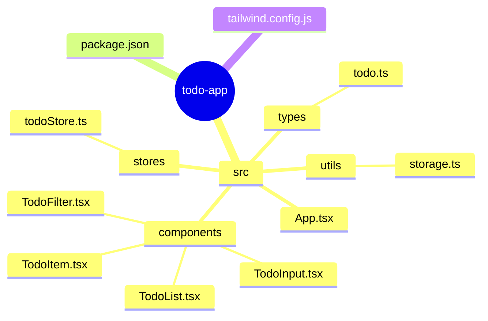

# SDD Practice: From Requirements to Code


## Course Objectives

Through this lesson, you will learn how to transform a real requirement into executable code through the SDD methodology.

## Practice Case: Todo Application

### Requirements Description

"Build a todo application where users can add, complete, and delete tasks."

### Step 1: Requirements Clarification

After communicating with the product manager, we obtained more detailed requirements:

```markdown
## Todo Application Requirements

### Core Features
1. Add tasks (text input)
2. Mark complete/incomplete
3. Delete tasks
4. View all tasks

### Extended Features
1. Task categorization (work/life/study)
2. Task priority
3. Due date
4. Data persistence

### Technical Requirements
- Frontend: React + TypeScript
- State Management: Zustand
- Styling: Tailwind CSS
- Storage: LocalStorage

### Acceptance Criteria
- Beautiful interface, responsive design
- Smooth operations with animation feedback
- Data persists after refresh
```

### Step 2: Write Technical Specification

**Todo Application Technical Specification**

---
Version: 1.0.0
Date: 2025-01-15
---

#### 1. Project Structure



#### 2. Data Model

```typescript
interface Todo {
  id: string;
  text: string;
  completed: boolean;
  category: 'work' | 'life' | 'study';
  priority: 'low' | 'medium' | 'high';
  createdAt: Date;
  dueDate?: Date;
}

interface TodoState {
  todos: Todo[];
  filter: 'all' | 'active' | 'completed';
  categoryFilter: string | null;
}
```

#### 3. Component Specification

**TodoInput**
- Function: Input new tasks
- Props: `onAdd: (text: string, category: string) => void`
- Features: Enter to add, empty value validation

**TodoItem**
- Function: Display single task
- Props: `todo: Todo, onToggle: () => void, onDelete: () => void`
- Features: Completion strikethrough animation, delete confirmation

**TodoList**
- Function: Task list display
- Props: `todos: Todo[], filter: string`
- Features: Empty state prompt, filtered display

#### 4. State Management

Use Zustand to manage:
- Task list
- Filter conditions
- Local storage synchronization

#### 5. Styling Specification

- Use Tailwind CSS
- Primary color: Blue (#3b82f6)
- Responsive: Mobile-first
- Animations: Use Tailwind transitions

### Step 3: Let AI Generate Code

Provide the specification to AI:

```
Please implement the todo application based on the following specification:

[ Paste the specification above ]

Please implement in the following steps:
1. Create project structure and configuration files
2. Implement type definitions
3. Implement state management (Zustand store)
4. Implement individual components
5. Assemble App.tsx
6. Add styles

Please let me know after each step is completed, I will confirm before continuing to the next step.
```

### Step 4: Review and Iterate

After AI generates code, conduct review:

```
I reviewed the code and have the following issues that need fixing:

1. TodoItem component is missing completion animation
2. No confirmation prompt before deleting tasks
3. Filter displays incorrectly on mobile

Please fix these issues.
```

### Step 5: Verify Acceptance

Check against acceptance criteria:

- [x] Beautiful interface, responsive design
- [x] Smooth operations with animation feedback
- [x] Data persists after refresh
- [x] Can add, complete, delete tasks
- [x] Supports task categorization and filtering

## SDD Practice Key Points

### 1. Specifications Should Be Detailed Enough

Don't assume AI knows your intent; write everything clearly.

### 2. Implement in Steps

Don't let AI implement all features at once; do it step by step, verifying each step.

### 3. Timely Feedback

Point out problems immediately when found; don't let errors accumulate.

### 4. Keep Specifications

Specifications are the core documentation of the project and should be version-controlled.

## Common Mistakes

### Mistake 1: Too Rough Specification

```
❌ "Build a todo app"

Result: AI might build the simplest version, no categorization, no persistence
```

### Mistake 2: Asking Too Much at Once

```
❌ "Implement all features"

Result: Poor code quality, many bugs
```

### Mistake 3: Not Verifying Before Continuing

```
❌ Directly let AI continue to the next step without checking the current step

Result: Errors accumulate, eventually need to rewrite
```

## Exercises

Now, please try to implement a simple calculator application using the SDD method:

1. Write specification (features, UI, technical requirements)
2. Let AI implement according to specification
3. Review and iterate
4. Verify acceptance

---

**Next**: Learn [1.5 Write Your First AI Command](/tutorial/L1-5)
