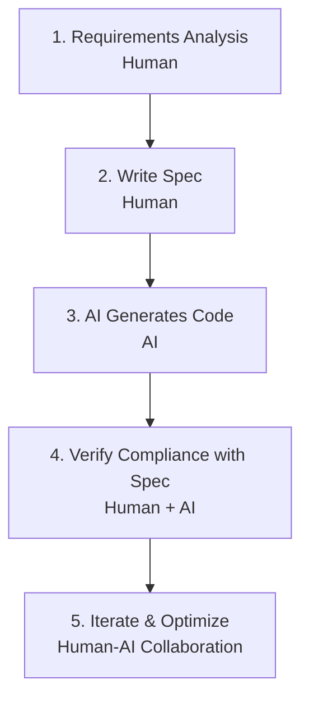

# The Importance of Specifications: Code is an Afterthought to Specifications


## Reunderstanding Specifications

In traditional development, we often write code first and then "顺便" write documentation. Specifications are often seen as a burden.

But in the AI era, this order must be reversed.

> **Specifications are not an accessory to code, but the source of code.**

## What is SDD (Specification-Driven Development)?

SDD = Specification-Driven Development

This is a completely new development paradigm that emerged in 2025, with the core philosophy being:

> First write "executable specifications (Spec)", then have humans or AI generate, verify, and evolve code according to the specifications.

### SDD Subverts Traditional Relationships

| Traditional Development | SDD Paradigm |
|---------|---------|
| Code first, documentation later | Specifications first, code generation |
| Code is design | Specifications are design |
| Code is the product | Specifications are the single source of truth |
| Humans write code | AI generates code according to specifications |

### SDD Workflow



## Why are Specifications First?

### 1. Specifications are the Window for AI to Understand Tasks

AI doesn't have "mind reading"; it can only see the information you provide. The clarity of specifications directly determines the quality of AI output.

**Comparison Example:**

> ❌ **Vague Requirement**:
> "Build a user login feature"
>
> **What AI might understand**:
> - Username/password login
> - Phone verification code login
> - Email login
> - Third-party OAuth login
> - QR code login
> - ...
>
> **Result**: AI randomly chooses one implementation, most likely not meeting expectations

---

> ✅ **Clear Specification**:
>
> ## User Login Module Specification
>
> ### Functional Requirements
> 1. Support email + password login
> 2. Display "Email or password incorrect" when password is wrong
> 3. Redirect to homepage after successful login
> 4. Keep login state for 7 days
>
> ### Technical Requirements
> - Use JWT Token authentication
> - Password stored with bcrypt encryption
> - Interface needs brute force protection (lock for 15 minutes after 5 failed attempts)
>
> ### Acceptance Criteria

```markdown
- [ ] Correct email and password can login
- [ ] Wrong password shows friendly message
- [ ] Login state persists within token validity period
- [ ] Account locked after 5 failed attempts
```
>
> **AI Understanding**: Clear, specific, verifiable
> **Result**: Implemented according to spec, done right the first time

### 2. Specifications are the Standard for Verification

With specifications, we can:
- Let AI self-check code against specifications
- Clearly determine if code is "complete"
- Reduce rework and misunderstandings

**Self-Check Example:**

```markdown
AI, please check if this code complies with the following specification:
- [specification content]

If it doesn't comply, please point out specific issues and fix them.
```

### 3. Specifications are the Bridge for Team Communication

**Product Manager (business language)**:
> "Users should be able to log in conveniently"

↓ **Translate to**

**Specification (technical language)**:
> "Login page includes email input field, password input field, login button"
> "Email needs format validation"
> "Password needs strength check"
> ...

↓ **Implemented as**

**Code (machine language)**:
> [specific code implementation]

Specifications serve as an intermediate layer, connecting business requirements and technical implementation.

## Code is an Afterthought to Specifications

This phrase means:

> **Code is only the "implementation" of specifications; specifications are the "essence"**

### If the specification is wrong...

No matter how well the code is written, it's wrong.

**Example:**
> **Specification**: Calculate the area of a circle, formula is A = 2πr
>
> **Code**: Perfectly implements this formula
>
> **Result**: Wrong! Correct formula is A = πr²

### If the specification is clear...

Code generation is natural.

**Example:**
> **Specification**: Calculate the area of a circle, formula is A = πr²
>
> **AI Generated Code**:
> ```python
> import math
>
> def circle_area(radius):
>     return math.pi * radius ** 2
> ```
>
> **Result**: Correct, clean, compliant with specification

## A Real Counterexample

### Scenario

Product Manager: "Build a login page"

### Result Without Specification

Developer (or AI) implemented based on experience:
- ✅ Username input
- ✅ Password input
- ✅ Login button
- ✅ Error message
- ✅ Remember me function
- ✅ Verification code
- ✅ Third-party login (WeChat, QQ, GitHub)
- ✅ Phone number login
- ✅ QR code login
- ✅ Forgot password
- ✅ Registration entrance
- ✅ ...

### Problems

**None of these were mentioned in the requirements!**

What the product manager actually wanted was just a simple internal system login, not:
- Third-party login
- Phone number login
- Verification code
- QR code login

**Result:**
- Wasted development time
- Increased maintenance costs
- Introduced unnecessary security risks
- Product wasn't satisfied

## The Correct Approach

### Scenario

Product Manager: "Build a login page"

### Step 1: Clarify Requirements, Write Specification

```markdown
## Login Page Specification

### Background
Internal management system login, for company employees only

### Functional Requirements
1. Email + password login
2. Error messages (don't expose whether email or password is wrong)
3. Redirect to dashboard after successful login
4. Remember me (valid for 7 days)

### Non-Functional Requirements
1. No registration needed (accounts created by administrator)
2. No third-party login needed
3. No verification code needed (internal system, protected by IP whitelist)

### Acceptance Criteria
- [ ] Correct credentials can login
- [ ] Incorrect credentials show "Email or password incorrect"
- [ ] Remember me function works correctly
- [ ] Accessing other pages without login automatically redirects to login page
```

### Step 2: AI Generates Code According to Specification

Code generated by AI:
- Only includes features required in the specification
- Not too much or too little, just right
- Meets security requirements

### Result

- ✅ High development efficiency
- ✅ Low maintenance cost
- ✅ Product satisfied
- ✅ Secure and reliable

## Core Value of SDD

### 1. Improve Development Efficiency

- Reduce requirements communication costs
- Reduce rework
- AI can generate multiple modules in parallel

### 2. Improve Code Quality

- Specifications are test standards
- Reduce omissions and misunderstandings
- Easy for code review

### 3. Reduce Maintenance Costs

- Specifications are documentation
- New team members quickly understand the system
- Changes have basis to follow

### 4. Enable Human-AI Collaboration

- Humans focus on thinking and design
- AI focuses on implementation and optimization
- Each maximizes its value

## Transition from Traditional Development to SDD

### Mindset Transformation

| Traditional Mindset | SDD Mindset |
|---------|---------|
| "Let me try writing code first" | "Let me think through the specification first" |
| "Code is design" | "Specifications are design, code is just implementation" |
| "Write and modify as you go" | "Specifications first, implementation second, verification third" |
| "Documentation is a burden" | "Specifications are core assets" |

### Work Method Transformation

**Traditional Method**:
1. Requirements
2. Write code
3. Test
4. Find it's wrong
5. Modify code
6. Test...

**SDD Method**:
1. Requirements
2. Write specification
3. AI generates
4. Verify
5. Fine-tune
6. Complete

## Suggestions for Beginners

### Getting Started Phase

1. **Start with small features**: Write specifications for simple features first
2. **Use templates**: Reference standard specification templates
3. **Collaborate with AI**: Let AI help improve specifications

### Intermediate Phase

1. **Build specification library**: Accumulate reusable specification templates
2. **Team collaboration**: Share specification standards with the team
3. **Continuous optimization**: Improve specifications based on practical feedback

### Expert Phase

1. **Design specification languages**: Design DSLs for specific domains
2. **Automated verification**: Let AI automatically check specification completeness
3. **Specifications as code**: Bring specifications under version control, evolving with code

## Summary

| Dimension | Traditional Development | SDD Development |
|------|---------|---------|
| **Core Output** | Code | Specification + Code |
| **Development Starting Point** | Code editor | Specification document |
| **AI Role** | Code completion | Specification implementer |
| **Human Role** | Code writer | Specification designer |
| **Quality Assurance** | Test-driven | Specification-driven |
| **Knowledge沉淀** | Code comments | Specification documents |

> **Specifications are the programming language of the AI era. Mastering specification writing is the core skill of becoming an AI Commander.**

---

**Next**: Learn [2.2 How to Write Good Technical Specifications](/tutorial/L2-2)

## Reference Resources

- [SDD: Specification-Driven Development - Juejin](https://juejin.cn/post/7564077271251828751)
- [AI SDD Development Paradigm - Toutiao](http://m.toutiao.com/group/7602504481393115663/)
- [Multi AI Collaboration + SDD Programming Practice - Toutiao](http://m.toutiao.com/group/7601028280992514560/)
- [2026 Programmer Breakthrough Guide - Toutiao](http://m.toutiao.com/group/7603553205129200138/)
- [Spec-Driven Development - Al Harris](https://spec-driven.dev)
