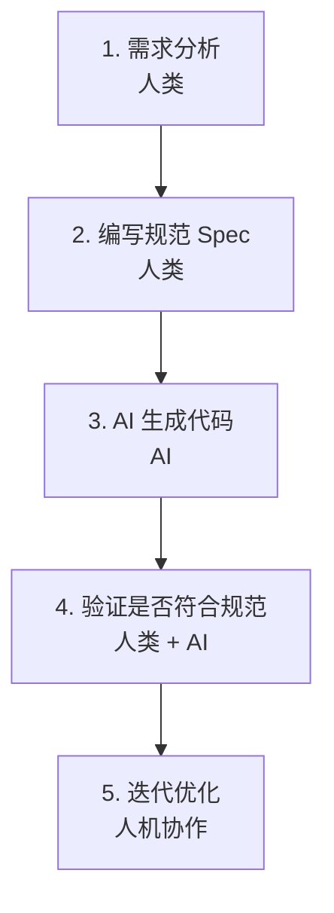

# 规范的重要性：代码是规范的马后炮


## 重新认识规范

在传统开发中，我们经常是先写代码，然后「顺便」补文档。规范往往被视为负担。

但在 AI 时代，这个顺序必须颠倒过来。

> **规范不是代码的附属品，而是代码的源头。**

## 什么是 SDD（Specification-Driven Development）？

SDD = Specification-Driven Development（规范驱动开发）

这是 2025 年兴起的全新开发范式，核心理念是：

> 先写"可执行的规格说明(Spec)"，再让人或 AI 按规格生成、验证、演进代码。

### SDD 颠覆了传统关系

| 传统开发 | SDD 范式 |
|---------|---------|
| 代码优先，文档后补 | 规范优先，代码生成 |
| 代码即设计 | 规范即设计 |
| 代码是产品 | 规范是单一事实来源 |
| 人写代码 | AI 按规范生成代码 |

### SDD 工作流



## 为什么规范是第一位的？

### 1. 规范是 AI 理解任务的窗口

AI 没有「读心术」，它只能看到你给出的信息。规范的清晰度直接决定了 AI 的输出质量。

**示例对比：**

> ❌ **模糊需求**：
> "做一个用户登录功能"
> 
> **AI 理解的可能**：
> - 用户名密码登录
> - 手机号验证码登录
> - 邮箱登录
> - 第三方 OAuth 登录
> - 扫码登录
> - ...
> 
> **结果**：AI 随机选择一种实现，大概率不符合预期

---

> ✅ **清晰规范**：
> 
> ## 用户登录模块规范
> 
> ### 功能需求
> 1. 支持邮箱 + 密码登录
> 2. 密码错误时显示提示"邮箱或密码错误"
> 3. 登录成功后跳转到首页
> 4. 登录状态保持 7 天
> 
> ### 技术要求
> - 使用 JWT Token 认证
> - 密码使用 bcrypt 加密存储
> - 接口需要防暴力破解（5次错误后锁定15分钟）
> 
> ### 验收标准

```markdown
- [ ] 正确的邮箱密码可以登录
- [ ] 错误的密码显示友好提示
- [ ] Token 有效期内免登录
- [ ] 超出 5 次错误后账户锁定
```
> 
> **AI 理解**：明确、具体、可验证  
> **结果**：按规范实现，一次到位

### 2. 规范是验证的标准

有了规范，我们可以：
- 让 AI 根据规范自检代码
- 明确判断代码是否「完成」
- 减少返工和误解

**自检示例：**

```markdown
AI，请检查这段代码是否符合以下规范：
- [规范内容]

如果不符合，请指出具体问题并修复。
```

### 3. 规范是团队沟通的桥梁

**产品经理（业务语言）**：
> "用户应该能方便地登录"

↓ **翻译成**

**规范（技术语言）**：
> "登录页面包含邮箱输入框、密码输入框、登录按钮"  
> "邮箱需要格式验证"  
> "密码需要强度检查"  
> ...

↓ **实现为**

**代码（机器语言）**：
> [具体代码实现]

规范作为中间层，连接业务需求和技术实现。

## 代码是规范的马后炮

这句话的意思是：

> **代码只是规范的「实现」，规范才是「本质」**

### 如果规范错了...

代码写得再好也是错的。

**示例：**
> **规范**：计算圆的面积，公式是 A = πr²
>
> **代码**：完美实现了这个公式
>
> **结果**：正确！

### 如果规范清楚了...

代码生成就是水到渠成的事。

**示例：**
> **规范**：计算圆的面积，公式是 A = πr²
> 
> **AI 生成代码**：
> ```python
> import math
> 
> def circle_area(radius):
>     return math.pi * radius ** 2
> ```
> 
> **结果**：正确、简洁、符合规范

## 一个真实的反例

### 场景

产品经理："做个登录页面"

### 没有规范的结果

开发者（或 AI）凭经验实现了：
- ✅ 用户名输入
- ✅ 密码输入
- ✅ 登录按钮
- ✅ 错误提示
- ✅ 记住我功能
- ✅ 验证码
- ✅ 第三方登录（微信、QQ、GitHub）
- ✅ 手机号登录
- ✅ 扫码登录
- ✅ 忘记密码
- ✅ 注册入口
- ...

### 问题

**需求里根本没提这些！**

产品经理实际想要的只是一个简单的内部系统登录，不需要：
- 第三方登录
- 手机号登录
- 验证码
- 扫码登录

**结果：**
- 浪费了开发时间
- 增加了维护成本
- 引入了不必要的安全风险
- 产品不满意

## 正确的做法

### 场景

产品经理："做个登录页面"

### 第一步：澄清需求，编写规范

```markdown
## 登录页面规范

### 背景
内部管理系统登录，仅供公司员工使用

### 功能需求
1. 邮箱 + 密码登录
2. 错误提示（不暴露具体是邮箱错还是密码错）
3. 登录成功后跳转到仪表盘
4. 记住我（7天有效）

### 非功能需求
1. 不需要注册（账号由管理员统一创建）
2. 不需要第三方登录
3. 不需要验证码（内部系统，IP 白名单保护）

### 验收标准
- [ ] 正确凭据可以登录
- [ ] 错误凭据显示"邮箱或密码错误"
- [ ] 记住我功能正常工作
- [ ] 未登录访问其他页面自动跳转登录页
```

### 第二步：AI 按规范生成代码

AI 生成的代码：
- 只包含规范中要求的功能
- 不多不少，刚刚好
- 符合安全要求

### 结果

- ✅ 开发效率高
- ✅ 维护成本低
- ✅ 产品满意
- ✅ 安全可靠

## SDD 的核心价值

### 1. 提高开发效率

- 减少需求沟通成本
- 减少返工
- AI 可以并行生成多个模块

### 2. 提升代码质量

- 规范即测试标准
- 减少遗漏和误解
- 便于代码审查

### 3. 降低维护成本

- 规范即文档
- 新人快速理解系统
- 变更时有据可依

### 4. 实现人机协作

- 人类专注于思考和设计
- AI 专注于实现和优化
- 各自发挥最大价值

## 从传统开发到 SDD 的转变

### 思维转变

| 传统思维 | SDD 思维 |
|---------|---------|
| "我先写代码试试" | "我先想清楚规范" |
| "代码就是设计" | "规范才是设计，代码只是实现" |
| "边写边改" | "先规范，后实现，再验证" |
| "文档是负担" | "规范是核心资产" |

### 工作方式转变

**传统方式**：
1. 需求
2. 写代码
3. 测试
4. 发现不对
5. 改代码
6. 测试...

**SDD 方式**：
1. 需求
2. 写规范
3. AI 生成
4. 验证
5. 微调
6. 完成

## 给初学者的建议

### 起步阶段

1. **从小功能开始**：先给简单功能写规范
2. **使用模板**：参考标准规范模板
3. **与 AI 协作**：让 AI 帮你完善规范

### 进阶阶段

1. **建立规范库**：积累可复用的规范模板
2. **团队协作**：与团队共享规范标准
3. **持续优化**：根据实践反馈改进规范

### 专家阶段

1. **设计规范语言**：针对特定领域设计 DSL
2. **自动化验证**：让 AI 自动检查规范完整性
3. **规范即代码**：将规范纳入版本控制，与代码同步演进

## 总结

| 维度 | 传统开发 | SDD 开发 |
|------|---------|---------|
| **核心产出** | 代码 | 规范 + 代码 |
| **开发起点** | 代码编辑器 | 规范文档 |
| **AI 角色** | 代码补全 | 规范实现者 |
| **人类角色** | 代码编写者 | 规范设计者 |
| **质量保证** | 测试驱动 | 规范驱动 |
| **知识沉淀** | 代码注释 | 规范文档 |

> **规范是 AI 时代的编程语言，掌握规范写作是成为 AI 指挥官的核心技能。**

---

**下一步**：学习 [2.2 如何写好技术规范](/tutorial/L2-2)

## 参考资源

- [SDD: Specification-Driven Development - 掘金](https://juejin.cn/post/7564077271251828751)
- [AI SDD 开发范式 - 今日头条](http://m.toutiao.com/group/7602504481393115663/)
- [多 AI 协同 + SDD 编程实践 - 今日头条](http://m.toutiao.com/group/7601028280992514560/)
- [2026 年程序员破局指南 - 今日头条](http://m.toutiao.com/group/7603553205129200138/)
- [Spec-Driven Development - Al Harris](https://spec-driven.dev)
