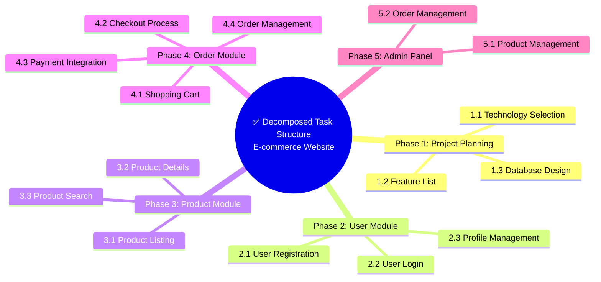

# Why Decompose Tasks?


## Complex Tasks Are AI's Nemesis

When you face a complex task, asking AI to execute it directly often yields unsatisfactory results. The reason is simple: **AI needs clear, specific instructions**.

> Complex tasks are like a tangled mess - AI has no idea where to start. Task decomposition untangles the mess, allowing AI to handle each strand one by one.

## Consequences of Not Decomposing Tasks

### Scenario: E-commerce Website Development

> ❌ **Giving AI complete requirements directly**:
> "Build an e-commerce website with user system, product system,
> order system, payment system, admin panel..."
>
> **AI might**:
> - Generate a simple HTML page
> - Not know that backend APIs are needed
> - Not know database design requirements
> - Miss key features like payment and order status
> - Produce messy, unmaintainable code structure
>
> **Result**: Completely different from expectations, needs rewrite

### Problem Analysis

| Problem | Cause |
|---------|-------|
| **Understanding deviation** | AI cannot process too much information at once |
| **Missing features** | Complex requirements are easily overlooked |
| **Low quality** | No clear acceptance criteria |
| **Unmaintainable** | Messy code structure |
| **Repeated rework** | Multiple modifications needed to approach the goal |

## Effects After Decomposition

### Same requirements, after decomposition:



### Advantages of Decomposition

| Advantage | Description |
|-----------|-------------|
| **Clear and definite** | Each subtask has a clear goal |
| **Executable** | AI can implement them one by one |
| **Verifiable** | Each task has acceptance criteria |
| **Trackable** | Clear progress visibility |
| **Maintainable** | Clear code structure |

## Core Principles of Task Decomposition

### 1. Actionable Principle

Each subtask should be **independently executable**.

```
❌ Bad task:
"Implement user system"

✅ Good task:
"Implement user registration API with email verification and password encryption"
```

### 2. Complete Principle

Decomposed subtasks should **cover all requirements**.

```
❌ Incomplete:
E-commerce Website
├── User Module
└── Product Module
(Missing order module!)

✅ Complete:
E-commerce Website
├── User Module
├── Product Module
├── Order Module
└── Payment Module
```

### 3. Mutually Exclusive Principle

Subtasks should **not overlap** with each other.

```
❌ With overlap:
├── User Management
├── User Permissions
└── Role Management
(Permissions and roles overlap)

✅ No overlap:
├── Authentication Module (Login/Register)
├── Authorization Module (Permission Check)
└── User Profile Module (Personal Information)
```

### 4. Dependencies Clear Principle

Clarify **dependencies between tasks**.

```
Dependency diagram:

Database Design
    ↓
User Module
    ↓
Product Module
    ↓
Order Module (depends on user and product)
    ↓
Payment Module (depends on order)
```

## Granularity of Task Decomposition

### Problems with Too Coarse Granularity

```
❌ Too coarse:
"Develop frontend"

Problems:
- Contains too many subtasks
- AI cannot complete it in one go
- Difficult to verify
```

### Problems with Too Fine Granularity

```
❌ Too fine:
"Create button component"
"Set button color"
"Set button size"

Problems:
- High management cost
- Frequent context switching
- Low efficiency
```

### Appropriate Granularity

```
✅ Appropriate:
"Implement login form component with email input,
password input, login button, and form validation"

Standards:
- Can be completed within 30 minutes
- Has clear acceptance criteria
- Can be tested independently
```

## Hierarchical Structure of Decomposition

### Three-Layer Decomposition Method

```
Layer 1: Phase
├── Project Planning
├── Core Features
├── Extended Features
└── Optimization and Refinement

Layer 2: Module
Project Planning
├── Technology Selection
├── Architecture Design
└── Development Standards

Layer 3: Task
Technology Selection
├── Frontend Framework Selection
├── Backend Framework Selection
└── Database Selection
```

### Decomposition Example: Blog System

```
Blog System
│
├── Phase 1: Basic Architecture
│   ├── 1.1 Project Initialization
│   │   ├── Create project structure
│   │   ├── Configure development environment
│   │   └── Set up code standards
│   ├── 1.2 Database Design
│   │   ├── Design user table
│   │   ├── Design article table
│   │   └── Design comment table
│   └── 1.3 Basic Components
│       ├── Layout components
│       ├── Navigation components
│       └── Form components
│
├── Phase 2: Core Features
│   ├── 2.1 User System
│   │   ├── Registration
│   │   ├── Login
│   │   └── Personal Center
│   ├── 2.2 Article System
│   │   ├── Article List
│   │   ├── Article Details
│   │   └── Article Editing
│   └── 2.3 Comment System
│       ├── Post Comment
│       └── Comment List
│
└── Phase 3: Enhanced Features
    ├── 3.1 Search Function
    ├── 3.2 Tag Classification
    └── 3.3 Article Recommendations
```

## Common Decomposition Methods

### Method 1: Decompose by Feature Module

```
E-commerce Website
├── User Module
├── Product Module
├── Order Module
├── Payment Module
└── Logistics Module
```

### Method 2: Decompose by Technical Layer

```
E-commerce Website
├── Frontend Presentation Layer
├── API Interface Layer
├── Business Logic Layer
├── Data Access Layer
└── Data Storage Layer
```

### Method 3: Decompose by Business Process

```
E-commerce Shopping Process
├── Browse Products
├── Add to Cart
├── Submit Order
├── Payment
├── Shipping
└── Confirm Receipt
```

### Method 4: Decompose by Priority

```
E-commerce Website (MVP First)
├── P0: Core Features
│   ├── User Login
│   ├── Product Display
│   └── Checkout Payment
├── P1: Important Features
│   ├── User Registration
│   ├── Shopping Cart
│   └── Order Management
└── P2: Value-Added Features
    ├── Product Search
    ├── User Reviews
    └── Recommendation System
```

## Decomposition Strategies for AI Collaboration

### Strategy 1: Plan First, Then Implement

```
Step 1: Have AI help you decompose
"I have a requirement: [describe requirement]
Please help me decompose it into an executable task list"

Step 2: Confirm decomposition results
Check if decomposition is complete and reasonable

Step 3: Implement one by one
"Please implement task 1: [task description]"
"Please implement task 2: [task description]"
...
```

### Strategy 2: Iterative Decomposition

```
First round: Coarse-grained decomposition
├── User Module
├── Product Module
└── Order Module

Second round: Refine user module
User Module
├── Registration (Email/Phone/Third-party)
├── Login (Password/Verification Code/QR Code)
└── Profile Management

Third round: Refine registration feature
Registration Feature
├── Email registration flow
├── Email verification
└── Password strength check
```

### Strategy 3: Templated Decomposition

Establish decomposition templates for common tasks:

```
Standard Web App Decomposition:
├── 1. Project Initialization
├── 2. Database Design
├── 3. Authentication & Authorization
├── 4. Core Features
├── 5. Admin Panel
└── 6. Testing & Deployment
```

## Acceptance Criteria for Decomposition

Good task decomposition should satisfy:

- [ ] Each task has a clear output
- [ ] Each task can be independently verified
- [ ] There are clear dependencies between tasks
- [ ] No requirements are missing
- [ ] No duplicate tasks
- [ ] Granularity is appropriate (30 minutes - 2 hours)

## Common Mistakes

### Mistake 1: Incomplete Decomposition

```
❌ "Implement user system"

✅ "Implement three features: user registration, login, and password reset"
```

### Mistake 2: Missing Dependencies

```
❌ Do orders first, then users
(Orders depend on user information)

✅ Do users first, then orders
```

### Mistake 3: Inconsistent Granularity

```
❌
├── Implement login (1 hour)
└── Implement entire admin system (1 week)

✅
├── Implement login (1 hour)
├── Implement user management (2 hours)
└── Implement order management (2 hours)
```

## Recommended Tools

- **Mind Mapping**: XMind, MindNode
- **Task Management**: Trello, Jira, Notion
- **Outline Tools**: Workflowy, Dynalist
- **Document Collaboration**: Notion, Confluence

---

**Next**: Learn [3.2 MECE Principle](/tutorial/L3-2)

## Reference Resources

- [Google Prompt Engineering Whitepaper](https://ai.google.dev/)
- [Task Decomposition Best Practices - Atlassian](https://www.atlassian.com/)
- [MECE Principle Explained - McKinsey](https://www.mckinsey.com/)
