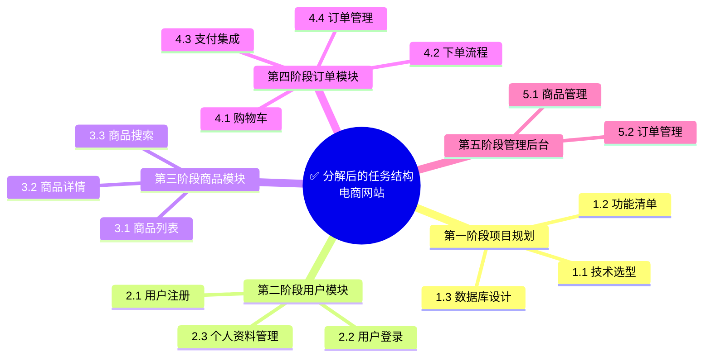

# 为什么要分解任务


## 复杂任务是 AI 的天敌

当你面对一个复杂任务时，直接让 AI 执行往往会得到不理想的结果。原因很简单：**AI 需要清晰、具体的指令**。

> 复杂任务就像一团乱麻，AI 无从下手。分解任务就是把乱麻理顺，让 AI 可以逐根处理。

## 不分解任务的后果

### 场景：开发电商网站

> ❌ **直接给 AI 完整需求**：
> "做一个电商网站，包含用户系统、商品系统、
> 订单系统、支付系统、后台管理..."
> 
> **AI 可能**：
> - 生成一个简单的 HTML 页面
> - 不知道需要后端 API
> - 不知道数据库设计
> - 遗漏支付、订单状态等关键功能
> - 代码结构混乱，无法维护
> 
> **结果**：完全不符合预期，需要重写

### 问题分析

| 问题 | 原因 |
|------|------|
| **理解偏差** | AI 无法同时处理太多信息 |
| **遗漏功能** | 复杂需求容易被忽略 |
| **质量低下** | 没有明确的验收标准 |
| **无法维护** | 代码结构混乱 |
| **反复返工** | 需要多次修改才能接近目标 |

## 分解后的效果

### 同样的需求，分解后：



### 分解后的优势

| 优势 | 说明 |
|------|------|
| **清晰明确** | 每个子任务都有明确的目标 |
| **可执行** | AI 可以逐个实现 |
| **可验证** | 每个任务都有验收标准 |
| **可追踪** | 清楚知道完成进度 |
| **可维护** | 代码结构清晰 |

## 任务分解的核心原则

### 1. 可执行原则（Actionable）

每个子任务都应该可以**独立执行**。

```
❌ 不好的任务：
"实现用户系统"

✅ 好的任务：
"实现用户注册接口，包含邮箱验证和密码加密"
```

### 2. 完整性原则（Complete）

分解后的子任务应该**覆盖所有需求**。

```
❌ 不完整：
电商网站
├── 用户模块
└── 商品模块
（遗漏了订单模块！）

✅ 完整：
电商网站
├── 用户模块
├── 商品模块
├── 订单模块
└── 支付模块
```

### 3. 互斥性原则（Mutually Exclusive）

子任务之间**不重叠**。

```
❌ 有重叠：
├── 用户管理
├── 用户权限
└── 角色管理
（权限和角色有重叠）

✅ 无重叠：
├── 认证模块（登录/注册）
├── 授权模块（权限检查）
└── 用户资料模块（个人信息）
```

### 4. 依赖明确原则（Dependencies Clear）

明确任务之间的**依赖关系**。

```
依赖关系图：

数据库设计
    ↓
用户模块
    ↓
商品模块
    ↓
订单模块（依赖用户和商品）
    ↓
支付模块（依赖订单）
```

## 任务分解的粒度

### 粒度太粗的问题

```
❌ 太粗：
"开发前端"

问题：
- 包含太多子任务
- AI 无法一次完成
- 难以验证
```

### 粒度太细的问题

```
❌ 太细：
"创建按钮组件"
"设置按钮颜色"
"设置按钮大小"

问题：
- 管理成本高
- 频繁切换上下文
- 效率低下
```

### 合适的粒度

```
✅ 合适：
"实现登录表单组件，包含邮箱输入、
密码输入、登录按钮和表单验证"

标准：
- 可以在 30 分钟内完成
- 有明确的验收标准
- 可以独立测试
```

## 分解的层次结构

### 三层分解法

```
第一层：阶段（Phase）
├── 项目规划
├── 核心功能
├── 扩展功能
└── 优化完善

第二层：模块（Module）
项目规划
├── 技术选型
├── 架构设计
└── 开发规范

第三层：任务（Task）
技术选型
├── 前端框架选择
├── 后端框架选择
└── 数据库选择
```

### 分解示例：博客系统

```
博客系统
│
├── 阶段 1：基础架构
│   ├── 1.1 项目初始化
│   │   ├── 创建项目结构
│   │   ├── 配置开发环境
│   │   └── 设置代码规范
│   ├── 1.2 数据库设计
│   │   ├── 设计用户表
│   │   ├── 设计文章表
│   │   └── 设计评论表
│   └── 1.3 基础组件
│       ├── 布局组件
│       ├── 导航组件
│       └── 表单组件
│
├── 阶段 2：核心功能
│   ├── 2.1 用户系统
│   │   ├── 注册功能
│   │   ├── 登录功能
│   │   └── 个人中心
│   ├── 2.2 文章系统
│   │   ├── 文章列表
│   │   ├── 文章详情
│   │   └── 文章编辑
│   └── 2.3 评论系统
│       ├── 发表评论
│       └── 评论列表
│
└── 阶段 3：增强功能
    ├── 3.1 搜索功能
    ├── 3.2 标签分类
    └── 3.3 文章推荐
```

## 分解的常用方法

### 方法 1：按功能模块分解

```
电商网站
├── 用户模块
├── 商品模块
├── 订单模块
├── 支付模块
└── 物流模块
```

### 方法 2：按技术层次分解

```
电商网站
├── 前端展示层
├── API 接口层
├── 业务逻辑层
├── 数据访问层
└── 数据存储层
```

### 方法 3：按业务流程分解

```
电商购物流程
├── 浏览商品
├── 加入购物车
├── 提交订单
├── 支付
├── 发货
└── 确认收货
```

### 方法 4：按优先级分解

```
电商网站（MVP 优先）
├── P0：核心功能
│   ├── 用户登录
│   ├── 商品展示
│   └── 下单支付
├── P1：重要功能
│   ├── 用户注册
│   ├── 购物车
│   └── 订单管理
└── P2：增值功能
    ├── 商品搜索
    ├── 用户评价
    └── 推荐系统
```

## 与 AI 协作的分解策略

### 策略 1：先规划，后实现

```
步骤 1：让 AI 帮你分解
"我有一个需求：[描述需求]
请帮我分解为可执行的任务列表"

步骤 2：确认分解结果
检查分解是否完整、合理

步骤 3：逐个实现
"请实现任务 1：[任务描述]"
"请实现任务 2：[任务描述]"
...
```

### 策略 2：迭代式分解

```
第一轮：粗粒度分解
├── 用户模块
├── 商品模块
└── 订单模块

第二轮：细化用户模块
用户模块
├── 注册（邮箱/手机/第三方）
├── 登录（密码/验证码/扫码）
└── 资料管理

第三轮：细化注册功能
注册功能
├── 邮箱注册流程
├── 邮箱验证
└── 密码强度检查
```

### 策略 3：模板化分解

建立常见任务的分解模板：

```
Web 应用标准分解：
├── 1. 项目初始化
├── 2. 数据库设计
├── 3. 认证授权
├── 4. 核心功能
├── 5. 管理后台
└── 6. 测试部署
```

## 分解的验收标准

好的任务分解应该满足：

- [ ] 每个任务都有明确的输出
- [ ] 每个任务都可以独立验证
- [ ] 任务之间有清晰的依赖关系
- [ ] 没有遗漏的需求
- [ ] 没有重复的任务
- [ ] 粒度适中（30 分钟 - 2 小时）

## 常见错误

### 错误 1：分解不彻底

```
❌ "实现用户系统"

✅ "实现用户注册、登录、密码重置三个功能"
```

### 错误 2：遗漏依赖

```
❌ 先做订单，后做用户
（订单依赖用户信息）

✅ 先做用户，后做订单
```

### 错误 3：粒度不一致

```
❌ 
├── 实现登录（1 小时）
└── 实现整个后台管理系统（1 周）

✅
├── 实现登录（1 小时）
├── 实现用户管理（2 小时）
└── 实现订单管理（2 小时）
```

## 工具推荐

- **思维导图**：XMind, MindNode
- **任务管理**：Trello, Jira, Notion
- **大纲工具**：Workflowy, Dynalist
- **文档协作**：Notion, Confluence

---

**下一步**：学习 [3.2 MECE 原则](/tutorial/L3-2)

## 参考资源

- [Google Prompt Engineering 白皮书](https://ai.google.dev/)
- [任务分解最佳实践 - Atlassian](https://www.atlassian.com/)
- [MECE 原则详解 - McKinsey](https://www.mckinsey.com/)
