# MECE Principle


## What is MECE?

**MECE** (pronounced "me-see") is a core thinking tool from McKinsey & Company, standing for:

- **M**utually **E**xclusive
- **C**ollectively **E**xhaustive

> The MECE principle ensures that when you decompose a problem, you neither miss anything nor have any overlap.

## Why is MECE So Important?

### Problems of Not Following MECE

#### Problem 1: Not Exhaustive

> ❌ **Incomplete feature list**:
>
> E-commerce website features:
> - User module
> - Product module
> - Order module
>
> **What's missing?**
> - Payment module!
> - Logistics module!
> - After-sales module!
>
> **Consequence**: Core features discovered missing after launch

#### Problem 2: Not Mutually Exclusive

> ❌ **Overlapping responsibilities**:
>
> Development team:
> - Frontend team (responsible for user interface)
> - Backend team (responsible for API interfaces)
> - Full-stack team (responsible for frontend and backend)
>
> **Problems**:
> - Full-stack team overlaps with frontend/backend teams
> - Task assignment conflicts
> - Unclear code ownership
>
> **Consequence**: Low team efficiency, finger-pointing

### Benefits of Following MECE

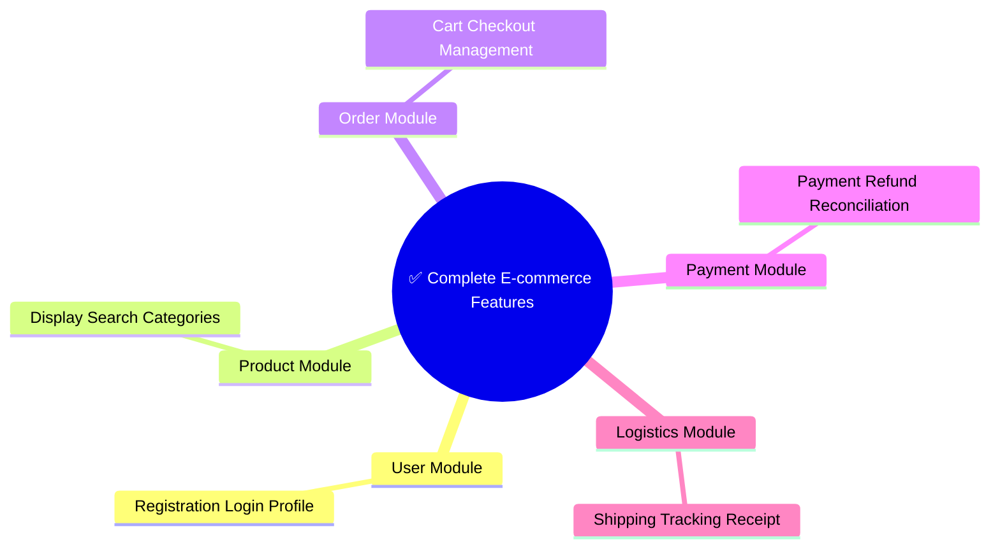

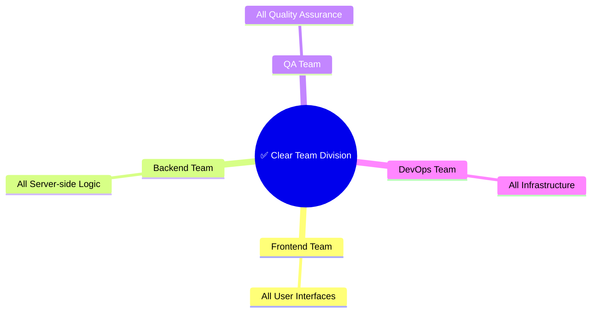

## Two Classification Methods in MECE

### Method 1: Binary Split

Dividing things into two opposing categories.

**Example: User Status**

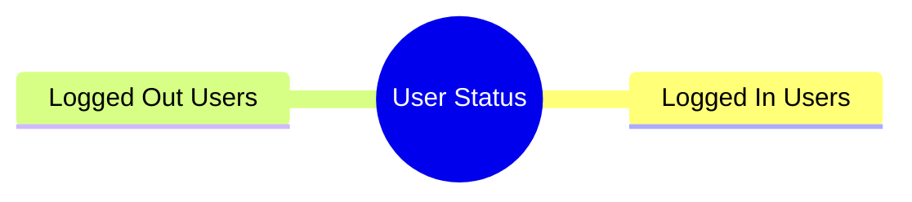

> Collectively Exhaustive: A user is either logged in or not logged out
> Mutually Exclusive: Cannot be in both states simultaneously

**Example: Order Status**

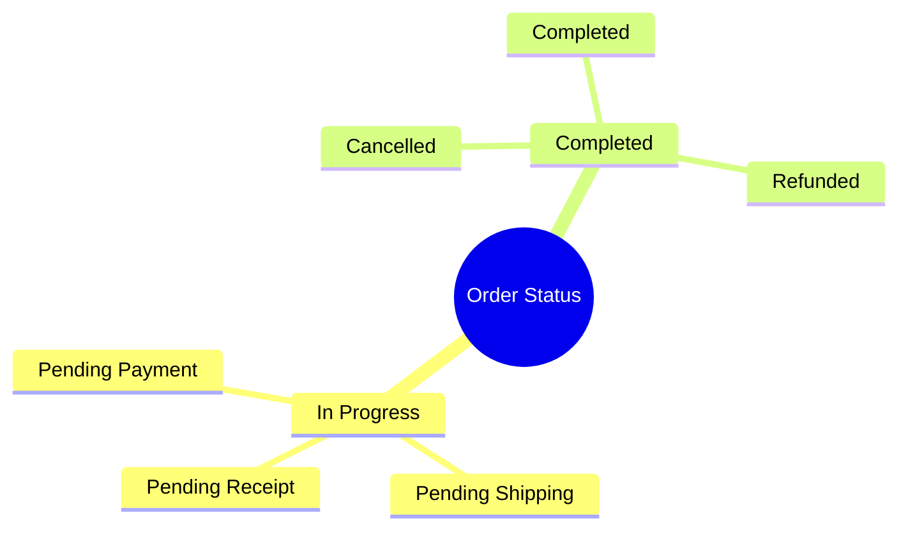

> Collectively Exhaustive: All orders belong to one of these two categories
> Mutually Exclusive: An order cannot be both in progress and completed

### Method 2: Process Flow

Classifying by time sequence or process steps.

**Example: User Registration Process**

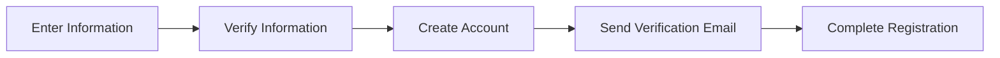

> Collectively Exhaustive: Covers all steps of registration
> Mutually Exclusive: Each step has a clear boundary

### Method 3: Component Breakdown

Classifying by components.

**Example: Website Composition**

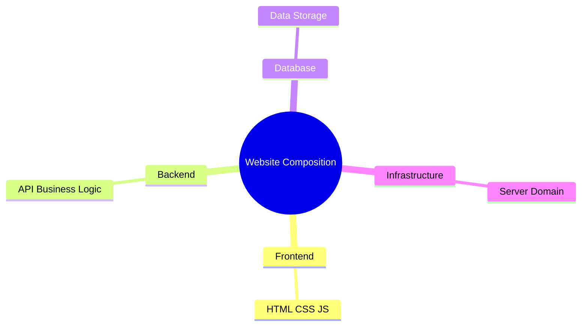

> Collectively Exhaustive: All components that make up a website
> Mutually Exclusive: Each component has clear responsibilities

## MECE Application in Programming

### Application 1: Feature Module Division

> ❌ **Bad division (with overlap)**:
>
> - User Management
> - User Permissions
> - Role Management
> - Permission Assignment
>
> **Problem**: Permissions and roles overlap

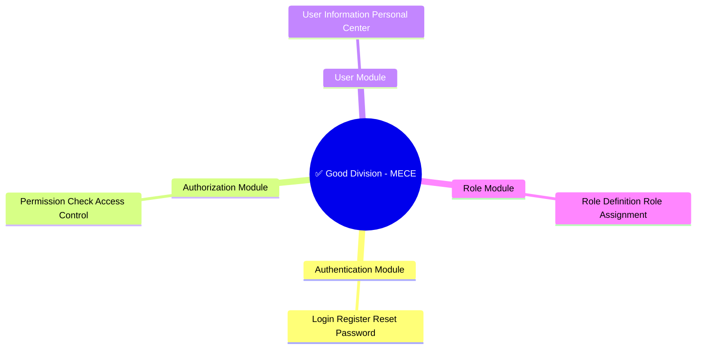

### Application 2: Error Handling Classification

> ❌ **Bad classification (not exhaustive)**:
>
> - Parameter error
> - Network error
> - Server error
>
> **Missing**: Permission errors, business logic errors

```mermaid
mindmap
  root((✅ Good Classification - MECE))
    Client Errors 4xx
      400 Parameter Error
      401 Unauthorized
      403 Forbidden
      404 Resource Not Found
    Server Errors 5xx
│   ├── 500 Internal Error
│   └── 503 Service Unavailable
└── Network Errors
    ├── Timeout
    └── Connection Failed
```

### Application 3: Test Case Design

> ❌ **Bad tests (with overlap)**:
>
> Testing login functionality:
> - Correct username and password
> - Wrong password
> - Empty username
> - Empty password
> - Username doesn't exist
>
> **Problem**: Empty username and username doesn't exist overlap

**✅ Good tests (MECE)**:

| Scenario Type | Test Case |
|-------------|-----------|
| **Normal Scenario** | Correct credentials login success, Remember me works |
| **Exception - Input Validation** | Empty email, Empty password, Invalid email format, Password too short |
| **Exception - Business Logic** | Email doesn't exist, Wrong password, Account locked |
| **Boundary Scenario** | Max email length, Max password length, Special character handling |

## How to Apply the MECE Principle

### Step 1: List All Elements

First, without worrying about classification, list all relevant elements.

```
E-commerce website features:
- User registration
- User login
- Product display
- Product search
- Add to cart
- Submit order
- Payment
- View order
- Cancel order
- Refund
- User review
- Coupon
- Points
- Membership level
```

### Step 2: Find Classification Dimensions

Find a dimension that can cover all elements:

| Dimension | Applicable Scenario |
|-----------|-------------------|
| **Feature Module** | System feature division |
| **User Role** | Permission design |
| **Business Process** | Process optimization |
| **Data Type** | Data modeling |
| **Time Sequence** | Process steps |
| **Importance** | Priority sorting |

### Step 3: Apply MECE Classification

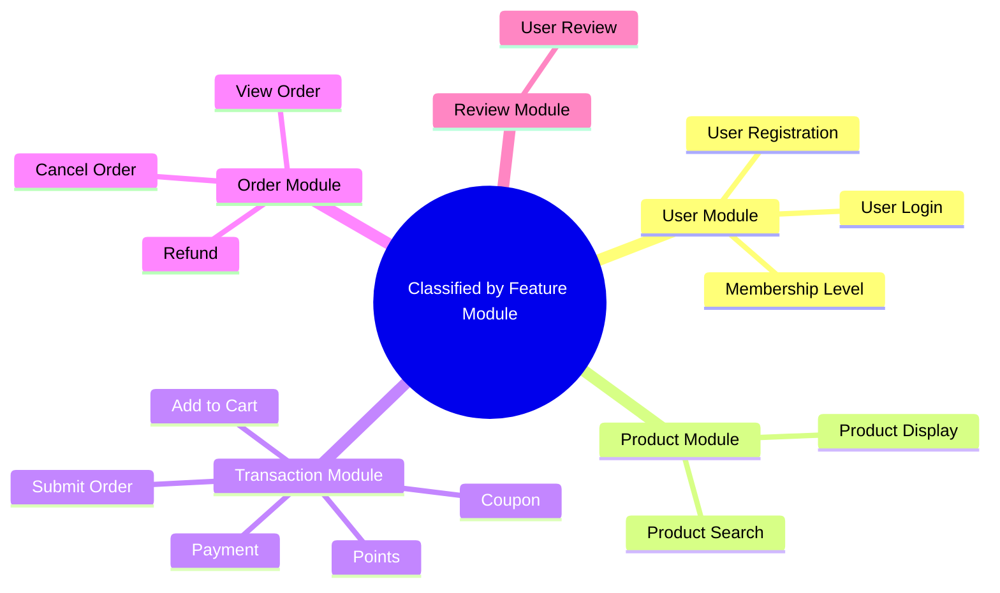

### Step 4: Verify MECE

**Check Mutually Exclusive:**
- Does user module overlap with product module? No ✓
- Does transaction module overlap with order module? No ✓

**Check Collectively Exhaustive:**
- Are all feature points included? Yes ✓
- Any omissions? No ✓

## Common MECE Frameworks

### 3C Model

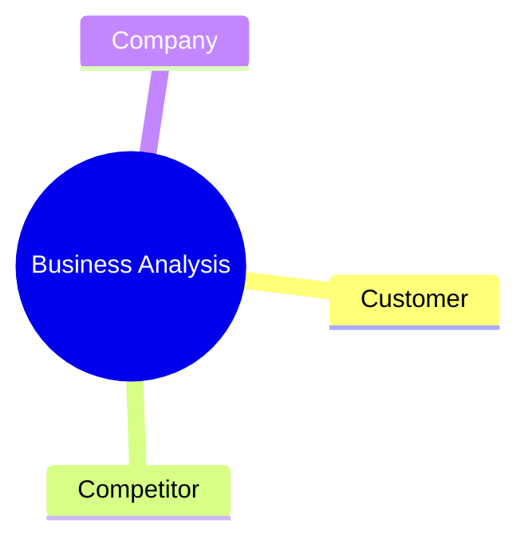

### 4P Model

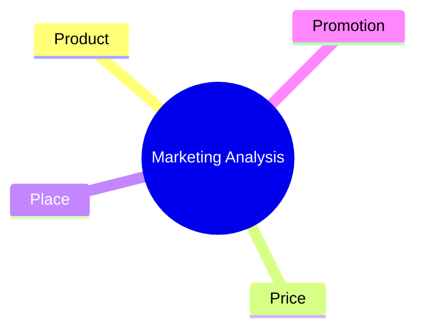

### SWOT Analysis

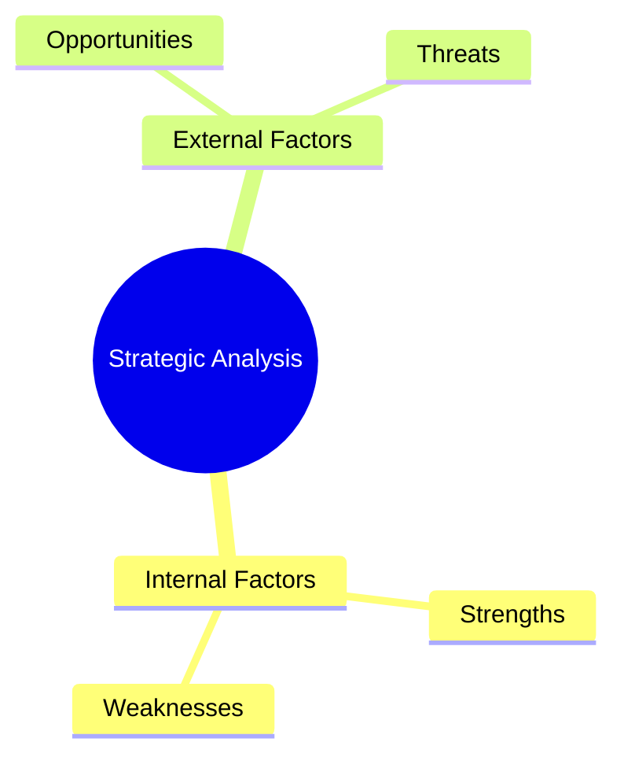

## MECE and AI Collaboration

### Have AI Help Check MECE

```markdown
Please check if the following classification follows the MECE principle:

[Your classification]

Please check:
1. Are there any omissions?
2. Are there any overlaps?
3. How can it be improved?
```

### Have AI Help Generate MECE Classification

```markdown
Please classify the following features according to the MECE principle:

Feature list:
- [Feature 1]
- [Feature 2]
- ...

Requirements:
1. Choose an appropriate classification dimension
2. Ensure mutually exclusive and collectively exhaustive
3. Each category has a clear definition
```

## MECE Practice Exercises

### Exercise 1: User Role Design

Design user roles for a blog system following the MECE principle.

```
Hints:
- Consider different permissions for readers
- Consider content creators
- Consider system administrators
```

### Exercise 2: Error Code Design

Design an error code system for API interfaces following the MECE principle.

```
Hints:
- Classify by error type
- Each error has a unique code
- Cover all possible error scenarios
```

### Exercise 3: Feature Module Division

Divide feature modules for an online education platform following the MECE principle.

```
Features:
- Course management
- Video playback
- Assignment submission
- Exam system
- Student management
- Teacher management
- Grade statistics
- Discussion forum
- Message notification
- Payment system
```

## Limitations of MECE

MECE is powerful, but it also has limitations:

1. **Not applicable to all situations**
   - Creative work may not require strict MECE
   - Exploratory tasks may not be able to be exhaustively defined in advance

2. **Over-classification**
   - Don't create unnecessary categories just for the sake of MECE
   - Keep classification practical

3. **Dynamic changes**
   - Systems evolve, and classifications need adjustment
   - Regularly review and optimize classifications

## Summary

| Principle | Meaning | Verification Method |
|-----------|---------|-------------------|
| **Mutually Exclusive** | Mutually independent | Ask: Do these categories overlap? |
| **Collectively Exhaustive** | Completely exhaustive | Ask: Is anything missing? |

**Core Points:**
- MECE is a thinking tool, not a rigid rule
- First pursue exhaustiveness, then optimize for independence
- When collaborating with AI, MECE classification helps AI better understand task structure

---

**Next**: Learn [3.3 AI-Assisted Requirements Analysis](/tutorial/L3-3)
