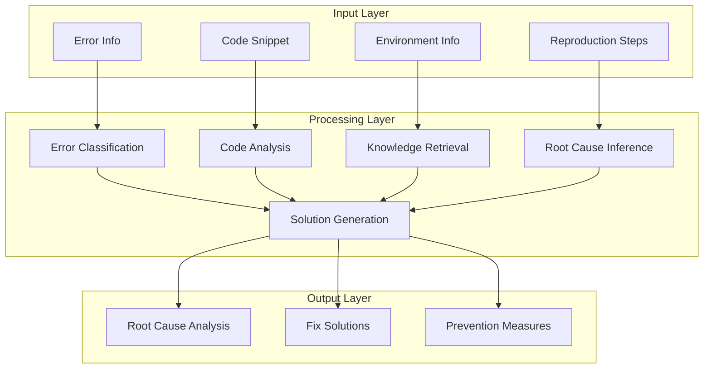
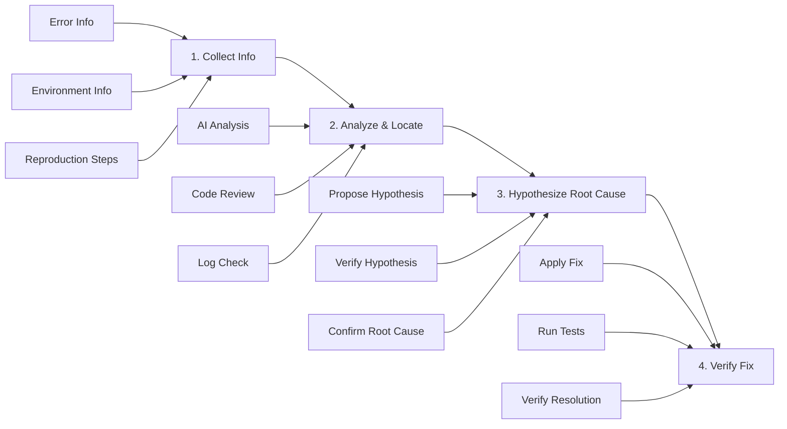

# L5-5: AI-assisted Debug Practice

> Making AI your debugging assistant for rapid problem location and resolution

## Chapter Overview

Debugging is one of the most time-consuming tasks in development. AI can not only generate code but also help you **quickly locate problems, analyze root causes, and provide fixes**. This chapter will teach you how to use AI for efficient debugging.

Through this chapter, you will learn:
- AI Debug core methodology
- How to provide effective debugging information
- AI diagnosis patterns for common issues
- Practice: Develop an intelligent Debug assistant

---

## 1. Advantages of AI Debug

### 1.1 Traditional Debug vs AI Debug

| Comparison Dimension | Traditional Debug | AI-assisted Debug |
|---------------------|-------------------|-------------------|
| **Steps** | 1. Reproduce issue<br>2. Set breakpoints<br>3. Step through<br>4. Check variables<br>5. Guess cause<br>6. Try fix<br>7. Verify repeatedly | 1. Describe issue<br>2. AI analyzes<br>3. Get solution<br>4. Verify fix |
| **Time** | 30 minutes - hours | 5-15 minutes |
| **Dependency** | Personal experience | Collective wisdom |

### 1.2 Core Capabilities of AI Debug

| Capability | Description | Example |
|------------|-------------|---------|
| **Pattern Recognition** | Recognize common error patterns | Quickly identify null pointer, out-of-bounds access |
| **Knowledge Retrieval** | Query related docs and cases | Find solutions to similar issues |
| **Logical Reasoning** | Analyze code execution flow | Infer possible execution paths and problem points |
| **Solution Generation** | Provide multiple fix options | Give short-term fixes and long-term optimizations |
| **Explanation** | Explain why problems occur | Help understand the cause of errors |

---

## 2. AI Debug Methodology

### 2.1 Information Collection Pyramid

Information collection hierarchy (from concrete to abstract):

1. **Expected Behavior** ← What should happen?
2. **Actual Behavior** ← What actually happened?
3. **Error Message** ← What was the error?
4. **Environment Info** ← What environment?

### 2.2 Effective Problem Description Framework

**RICE Framework:**

```markdown
## R - Reproduction
How to reproduce this issue?
1. Open page X
2. Click button Y
3. Input data Z
4. Error appears

## I - Information
- Browser: Chrome 120
- Framework: React 18.2
- Error frequency: every time/occasional

## C - Context
- Recent changes: Added user authentication
- Related features: Login, data fetching
- Impact scope: All users

## E - Error
```
TypeError: Cannot read property 'name' of undefined
    at UserProfile (UserProfile.tsx:23)
    at renderWithHooks (react-dom.development.js:16305)
```
```

### 2.3 Information Provision Checklist

- [ ] **Error Information**: Complete error message and stack trace
- [ ] **Reproduction Steps**: Clear, repeatable steps
- [ ] **Related Code**: Code snippets involved in the issue
- [ ] **Environment Info**: OS, browser, version numbers
- [ ] **Expected Behavior**: What you expected to happen
- [ ] **Actual Behavior**: What actually happened
- [ ] **Attempted Solutions**: What you've already tried
- [ ] **Related Config**: Config files, dependency versions

---

## 3. AI Diagnosis Patterns for Common Issues

### 3.1 Pattern 1: Null/Undefined Errors

**Issue Example:**
```javascript
// ❌ Wrong code
function UserProfile({ user }) {
  return <div>{user.name}</div>;  // TypeError: Cannot read property 'name' of undefined
}
```

**AI Diagnosis Prompt:**
```markdown
## Issue
React component error: TypeError: Cannot read property 'name' of undefined

## Code
```jsx
function UserProfile({ user }) {
  return <div>{user.name}</div>;
}
```

## Usage Scenario
```jsx
<UserProfile />  // No user prop passed
```

## Task
1. Analyze why the error occurs
2. Provide 3 fix solutions (from simple to comprehensive)
3. Explain pros and cons of each solution
```

**AI Analysis Result:**
```markdown
### Root Cause Analysis
The `user` prop received by the component is `undefined`. Accessing `user.name` throws an error.

### Fix Solutions

#### Solution 1: Optional Chaining (Simplest)
```jsx
function UserProfile({ user }) {
  return <div>{user?.name}</div>;
}
```
**Pros**: Simple and quick
**Cons**: Doesn't handle loading state

#### Solution 2: Default Value
```jsx
function UserProfile({ user = {} }) {
  return <div>{user.name || 'Anonymous User'}</div>;
}
```
**Pros**: Has default display
**Cons**: May mask data issues

#### Solution 3: Type Check + Loading State (Recommended)
```jsx
function UserProfile({ user }) {
  if (!user) {
    return <div>Loading...</div>;
  }
  
  return <div>{user.name}</div>;
}

// TypeScript version
interface UserProfileProps {
  user?: {
    name: string;
  };
}

function UserProfile({ user }: UserProfileProps) {
  if (!user) {
    return <div>Loading...</div>;
  }
  
  return <div>{user.name}</div>;
}
```
**Pros**: Robust, type-safe, good UX
**Cons**: More code
```

### 3.2 Pattern 2: Async Issues

**Issue Example:**
```javascript
// ❌ Wrong code
function fetchUserData() {
  let userData;
  fetch('/api/user')
    .then(response => response.json())
    .then(data => {
      userData = data;
    });
  return userData;  // undefined!
}
```

**AI Diagnosis Prompt:**
```markdown
## Issue
Function returns undefined, but API call succeeded

## Code
```javascript
function fetchUserData() {
  let userData;
  fetch('/api/user')
    .then(response => response.json())
    .then(data => {
      userData = data;
    });
  return userData;
}

const user = fetchUserData();
console.log(user);  // undefined
```

## Task
1. Explain why it returns undefined
2. Provide correct implementation
3. Explain JavaScript async execution mechanism
```

### 3.3 Pattern 3: Performance Issues

**Issue Example:**
```javascript
// ❌ Inefficient code
function UserList({ users }) {
  return (
    <div>
      {users.map(user => (
        <UserCard 
          key={user.id} 
          user={user}
          onClick={() => handleUserClick(user.id)}  // Creates new function on every render
        />
      ))}
    </div>
  );
}
```

**AI Diagnosis Prompt:**
```markdown
## Issue
User list rendering is sluggish, frame drops during scrolling

## Code
```jsx
function UserList({ users }) {
  return (
    <div>
      {users.map(user => (
        <UserCard 
          key={user.id} 
          user={user}
          onClick={() => handleUserClick(user.id)}
        />
      ))}
    </div>
  );
}
```

## Environment
- React 18
- User list: 1000+ items
- React DevTools Profiler shows frequent re-renders

## Task
1. Analyze performance bottleneck
2. Provide optimization solution
3. Explain how to verify optimization effect
```

---

## 4. Developing Intelligent Debug Assistant

### 4.1 Feature Design



### 4.2 Core Implementation

```typescript
// DebugAssistant.ts
import OpenAI from 'openai';

interface DebugContext {
  errorMessage: string;
  stackTrace?: string;
  codeSnippet?: string;
  environment?: {
    os?: string;
    browser?: string;
    framework?: string;
    version?: string;
  };
  reproductionSteps?: string[];
  expectedBehavior?: string;
  actualBehavior?: string;
}

interface DebugResult {
  rootCause: string;
  severity: 'critical' | 'high' | 'medium' | 'low';
  solutions: Array<{
    title: string;
    code: string;
    explanation: string;
    pros: string[];
    cons: string[];
  }>;
  prevention: string[];
  verificationSteps: string[];
}

export class DebugAssistant {
  private openai: OpenAI;
  
  constructor(apiKey: string) {
    this.openai = new OpenAI({ apiKey });
  }
  
  async analyze(context: DebugContext): Promise<DebugResult> {
    const prompt = this.buildPrompt(context);
    
    const response = await this.openai.chat.completions.create({
      model: 'gpt-4',
      messages: [
        {
          role: 'system',
          content: `You are a senior software engineer and debugging expert. Please analyze the provided error info,
find the root cause, provide multiple fix solutions, and give prevention measures. Output must be valid JSON format.`
        },
        {
          role: 'user',
          content: prompt
        }
      ],
      response_format: { type: 'json_object' },
      temperature: 0.3
    });
    
    return JSON.parse(response.choices[0].message.content);
  }
  
  private buildPrompt(context: DebugContext): string {
    return `
Please analyze the following debugging issue and provide solutions:

## Error Message
${context.errorMessage}

${context.stackTrace ? `## Stack Trace\n\`\`\`\n${context.stackTrace}\n\`\`\`` : ''}

${context.codeSnippet ? `## Related Code\n\`\`\`\n${context.codeSnippet}\n\`\`\`` : ''}

${context.environment ? `## Environment Info\n${JSON.stringify(context.environment, null, 2)}` : ''}

${context.reproductionSteps ? `## Reproduction Steps\n${context.reproductionSteps.map((s, i) => `${i + 1}. ${s}`).join('\n')}` : ''}

${context.expectedBehavior ? `## Expected Behavior\n${context.expectedBehavior}` : ''}

${context.actualBehavior ? `## Actual Behavior\n${context.actualBehavior}` : ''}

Please return analysis results in the following JSON format:

{\n  "rootCause": "Root cause description",\n  "severity": "critical|high|medium|low",\n  "solutions": [\n    {\n      "title": "Solution title",\n      "code": "Fixed code",\n      "explanation": "Explanation",\n      "pros": ["Advantage 1", "Advantage 2"],\n      "cons": ["Disadvantage 1", "Disadvantage 2"]\n    }\n  ],\n  "prevention": ["Prevention measure 1", "Prevention measure 2"],\n  "verificationSteps": ["Verification step 1", "Verification step 2"]\n}
    `.trim();
  }
}
```

### 4.3 Usage Example

```typescript
// Using Debug Assistant
const assistant = new DebugAssistant(process.env.OPENAI_API_KEY);

const result = await assistant.analyze({
  errorMessage: "TypeError: Cannot read property 'map' of undefined",
  stackTrace: `
    at UserList (UserList.tsx:15)
    at renderWithHooks (react-dom.development.js:16305)
  `,
  codeSnippet: `
function UserList() {
  const [users, setUsers] = use();
  
  useEffect(() => {
    fetchUsers().then(data => setUsers(data));
  }, []);
  
  return (
    <div>
      {users.map(user => <UserCard key={user.id} user={user} />)}
    </div>
  );
}
  `,
  environment: {
    framework: 'React',
    version: '18.2.0'
  },
  expectedBehavior: 'Display user list',
  actualBehavior: 'White screen, console error'
});

console.log('Analysis result:', result);
```

---

## 5. Debug Best Practices

### 5.1 Systematic Debug Process



### 5.2 Prevention Over Treatment

| Prevention Measure | Implementation Method |
|-------------------|----------------------|
| **Type Checking** | Use TypeScript, define clear interfaces |
| **Unit Testing** | Write test cases for core logic |
| **Error Boundaries** | Use Error Boundary to catch React errors |
| **Input Validation** | Validate all external input data |
| **Logging** | Add logs for key operations |
| **Code Review** | Team review to find potential issues |

### 5.3 Build Debug Knowledge Base

```mermaid
mindmap
  root((debug-knowledge))
    common-errors
      null-pointer.md
      async-timing.md
      closure-issues.md
      memory-leaks.md
    frameworks
      react
      vue
      nodejs
    solutions
      performance
      security
      compatibility
    case-studies
      - case-001.md
      - case-002.md

---

## 6. Chapter Summary

### Core Points

1. **AI Debug greatly improves efficiency**, reducing from hours to minutes

2. **Effective problem description** is the key to success, use RICE framework to collect information

3. **Common error patterns** can be systematically analyzed and solved

4. **Prevention over treatment**, establish defense mechanisms like type checking, testing, and error boundaries

### Debug Checklist

**Before Submitting Issues:**
- [ ] Provided complete error information
- [ ] Included stack trace
- [ ] Provided related code
- [ ] Stated environment info
- [ ] Described reproduction steps
- [ ] Explained expected and actual behavior

**When Analyzing Issues:**
- [ ] Understood why the error occurred
- [ ] Considered multiple solutions
- [ ] Evaluated pros and cons of solutions
- [ ] Made verification plan

### Next Steps

**Chapter 5 Complete!**

You have mastered the core knowledge of Agent Skills Development:
- L5-1: Agent Skills System Overview
- L5-2: Skills Development Practice
- L5-3: Knowledge Base Construction & Management
- L5-4: Tool Integration & Extension
- L5-5: AI-assisted Debug Practice

Next, we will enter **Chapter 6: Multi-Agent Collaboration**, learning how to make multiple AI Agents work together to solve more complex problems.

→ [6.1 Multi-Agent Collaboration Overview](/tutorial/L6-1)
