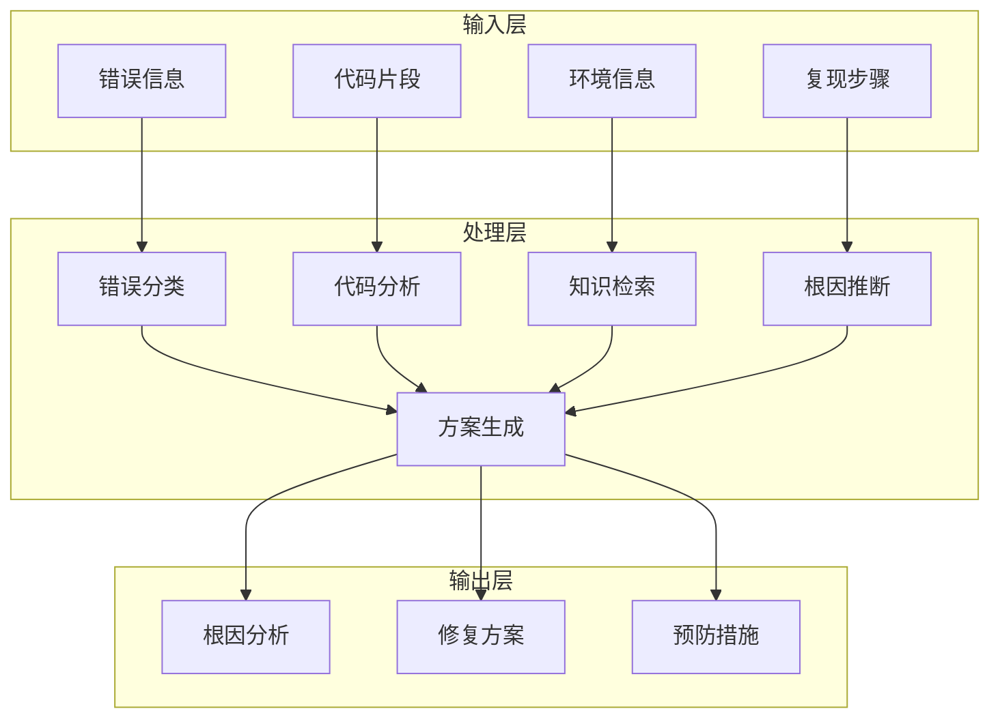
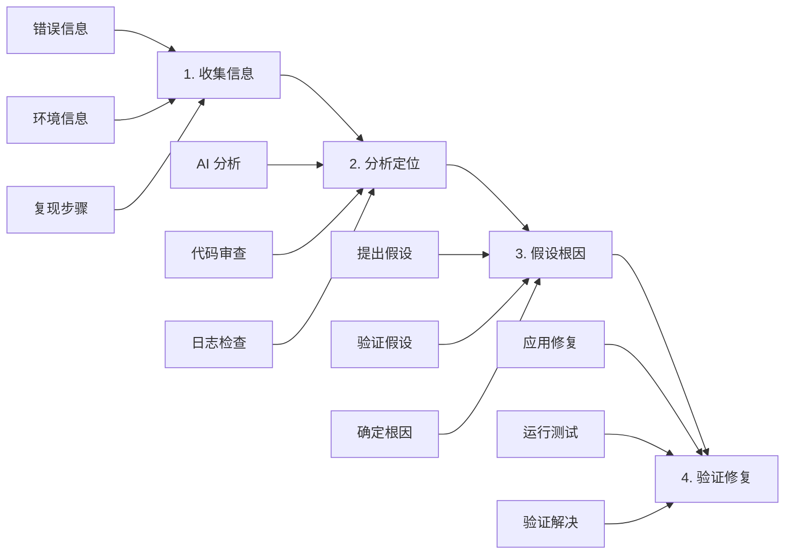

# L5-5: AI 辅助 Debug 实战

> 让 AI 成为你的调试助手，快速定位和解决问题

## 本节导读

调试是开发过程中最耗时的工作之一。AI 不仅能生成代码，更能帮助你**快速定位问题、分析根因、提供修复方案**。本节课将教你如何利用 AI 进行高效 Debug。

通过本节课，你将学会：
- AI Debug 的核心方法论
- 如何提供有效的调试信息
- 常见问题的 AI 诊断模式
- 实战：开发一个智能 Debug 助手

---

## 一、AI Debug 的优势

### 1.1 传统 Debug vs AI Debug

| 对比维度 | 传统 Debug | AI 辅助 Debug |
|---------|-----------|--------------|
| **步骤** | 1. 复现问题<br>2. 设置断点<br>3. 单步跟踪<br>4. 检查变量<br>5. 猜测原因<br>6. 尝试修复<br>7. 反复验证 | 1. 描述问题<br>2. AI 分析<br>3. 获得方案<br>4. 验证修复 |
| **耗时** | 30分钟-数小时 | 5-15分钟 |
| **依赖** | 个人经验 | 集体智慧 |

### 1.2 AI Debug 的核心能力

| 能力 | 说明 | 示例 |
|------|------|------|
| **模式识别** | 识别常见错误模式 | 快速识别 null pointer、越界访问 |
| **知识检索** | 查询相关文档和案例 | 找到类似问题的解决方案 |
| **逻辑推理** | 分析代码执行流程 | 推断可能的执行路径和问题点 |
| **方案生成** | 提供多种修复方案 | 给出短期修复和长期优化方案 |
| **解释说明** | 解释问题原因和原理 | 帮助理解为什么会出错 |

---

## 二、AI Debug 方法论

### 2.1 信息收集金字塔

信息收集层次（从具体到抽象）：

1. **期望行为** ← 应该发生什么？
2. **实际行为** ← 实际发生了什么？
3. **错误信息** ← 报错内容？
4. **环境信息** ← 什么环境？

### 2.2 有效的问题描述框架

**RICE 框架：**

```markdown
## R - Reproduction（复现）
如何复现这个问题？
1. 打开页面 X
2. 点击按钮 Y
3. 输入数据 Z
4. 错误出现

## I - Information（信息）
- 浏览器：Chrome 120
- 框架：React 18.2
- 错误频率：每次/偶发

## C - Context（上下文）
- 最近修改：添加了用户认证
- 相关功能：登录、数据获取
- 影响范围：所有用户

## E - Error（错误）
```
TypeError: Cannot read property 'name' of undefined
    at UserProfile (UserProfile.tsx:23)
    at renderWithHooks (react-dom.development.js:16305)
```

### 2.3 信息提供检查清单

- [ ] **错误信息**：完整的错误消息和堆栈跟踪
- [ ] **复现步骤**：清晰、可重复的步骤
- [ ] **相关代码**：涉及问题的代码片段
- [ ] **环境信息**：操作系统、浏览器、版本号
- [ ] **期望行为**：你期望发生什么
- [ ] **实际行为**：实际发生了什么
- [ ] **已尝试方案**：你已经尝试过什么
- [ ] **相关配置**：配置文件、依赖版本

---

## 三、常见问题的 AI 诊断模式

### 3.1 模式 1：Null/Undefined 错误

**问题示例：**
```javascript
// ❌ 错误代码
function UserProfile({ user }) {
  return <div>{user.name}</div>;  // TypeError: Cannot read property 'name' of undefined
}
```

**AI 诊断提示词：**
```markdown
## 问题
React 组件报错：TypeError: Cannot read property 'name' of undefined

## 代码
```jsx
function UserProfile({ user }) {
  return <div>{user.name}</div>;
}
```

## 使用场景
```jsx
<UserProfile />  // 没有传入 user
```

## 任务
1. 分析为什么会报错
2. 提供 3 种修复方案（从简单到完善）
3. 说明每种方案的优缺点
```

**AI 分析结果：**
```markdown
### 根因分析
组件接收的 `user` prop 为 `undefined`，访问 `user.name` 时抛出错误。

### 修复方案

#### 方案 1：可选链（最简单）
```jsx
function UserProfile({ user }) {
  return <div>{user?.name}</div>;
}
```
**优点**：简单快速
**缺点**：不处理加载状态

#### 方案 2：默认值
```jsx
function UserProfile({ user = {} }) {
  return <div>{user.name || '匿名用户'}</div>;
}
```
**优点**：有默认显示
**缺点**：可能掩盖数据问题

#### 方案 3：类型检查 + 加载状态（推荐）
```jsx
function UserProfile({ user }) {
  if (!user) {
    return <div>加载中...</div>;
  }
  
  return <div>{user.name}</div>;
}

// TypeScript 版本
interface UserProfileProps {
  user?: {
    name: string;
  };
}

function UserProfile({ user }: UserProfileProps) {
  if (!user) {
    return <div>加载中...</div>;
  }
  
  return <div>{user.name}</div>;
}
```
**优点**：健壮、类型安全、用户体验好
**缺点**：代码量增加
```

### 3.2 模式 2：异步问题

**问题示例：**
```javascript
// ❌ 错误代码
function fetchUserData() {
  let userData;
  fetch('/api/user')
    .then(response => response.json())
    .then(data => {
      userData = data;
    });
  return userData;  // undefined！
}
```

**AI 诊断提示词：**
```markdown
## 问题
函数返回 undefined，但 API 调用成功

## 代码
```javascript
function fetchUserData() {
  let userData;
  fetch('/api/user')
    .then(response => response.json())
    .then(data => {
      userData = data;
    });
  return userData;
}

const user = fetchUserData();
console.log(user);  // undefined
```

## 任务
1. 解释为什么返回 undefined
2. 提供正确的实现方式
3. 解释 JavaScript 异步执行机制
```

### 3.3 模式 3：性能问题

**问题示例：**
```javascript
// ❌ 低效代码
function UserList({ users }) {
  return (
    <div>
      {users.map(user => (
        <UserCard 
          key={user.id} 
          user={user}
          onClick={() => handleUserClick(user.id)}  // 每次渲染都创建新函数
        />
      ))}
    </div>
  );
}
```

**AI 诊断提示词：**
```markdown
## 问题
用户列表渲染卡顿，滚动时掉帧

## 代码
```jsx
function UserList({ users }) {
  return (
    <div>
      {users.map(user => (
        <UserCard 
          key={user.id} 
          user={user}
          onClick={() => handleUserClick(user.id)}
        />
      ))}
    </div>
  );
}
```

## 环境
- React 18
- 用户列表：1000+ 条数据
- 使用 React DevTools Profiler 发现频繁重渲染

## 任务
1. 分析性能瓶颈
2. 提供优化方案
3. 说明如何验证优化效果
```

---

## 四、智能 Debug 助手开发

### 4.1 功能设计



### 4.2 核心实现

```typescript
// DebugAssistant.ts
import OpenAI from 'openai';

interface DebugContext {
  errorMessage: string;
  stackTrace?: string;
  codeSnippet?: string;
  environment?: {
    os?: string;
    browser?: string;
    framework?: string;
    version?: string;
  };
  reproductionSteps?: string[];
  expectedBehavior?: string;
  actualBehavior?: string;
}

interface DebugResult {
  rootCause: string;
  severity: 'critical' | 'high' | 'medium' | 'low';
  solutions: Array<{
    title: string;
    code: string;
    explanation: string;
    pros: string[];
    cons: string[];
  }>;
  prevention: string[];
  verificationSteps: string[];
}

export class DebugAssistant {
  private openai: OpenAI;
  
  constructor(apiKey: string) {
    this.openai = new OpenAI({ apiKey });
  }
  
  async analyze(context: DebugContext): Promise<DebugResult> {
    const prompt = this.buildPrompt(context);
    
    const response = await this.openai.chat.completions.create({
      model: 'gpt-4',
      messages: [
        {
          role: 'system',
          content: `你是资深软件工程师和调试专家。请分析提供的错误信息，找出根本原因，
提供多种修复方案，并给出预防措施。输出必须是有效的 JSON 格式。`
        },
        {
          role: 'user',
          content: prompt
        }
      ],
      response_format: { type: 'json_object' },
      temperature: 0.3
    });
    
    return JSON.parse(response.choices[0].message.content);
  }
  
  private buildPrompt(context: DebugContext): string {
    return `
请分析以下调试问题并提供解决方案：

## 错误信息
${context.errorMessage}

${context.stackTrace ? `## 堆栈跟踪\n\`\`\`\n${context.stackTrace}\n\`\`\`` : ''}

${context.codeSnippet ? `## 相关代码\n\`\`\`\n${context.codeSnippet}\n\`\`\`` : ''}

${context.environment ? `## 环境信息\n${JSON.stringify(context.environment, null, 2)}` : ''}

${context.reproductionSteps ? `## 复现步骤\n${context.reproductionSteps.map((s, i) => `${i + 1}. ${s}`).join('\n')}` : ''}

${context.expectedBehavior ? `## 期望行为\n${context.expectedBehavior}` : ''}

${context.actualBehavior ? `## 实际行为\n${context.actualBehavior}` : ''}

请按以下 JSON 格式返回分析结果：

{\n  "rootCause": "根本原因描述",\n  "severity": "critical|high|medium|low",\n  "solutions": [\n    {\n      "title": "方案标题",\n      "code": "修复后的代码",\n      "explanation": "解释说明",\n      "pros": ["优点1", "优点2"],\n      "cons": ["缺点1", "缺点2"]\n    }\n  ],\n  "prevention": ["预防措施1", "预防措施2"],\n  "verificationSteps": ["验证步骤1", "验证步骤2"]\n}
    `.trim();
  }
}
```

### 4.3 使用示例

```typescript
// 使用 Debug 助手
const assistant = new DebugAssistant(process.env.OPENAI_API_KEY);

const result = await assistant.analyze({
  errorMessage: "TypeError: Cannot read property 'map' of undefined",
  stackTrace: `
    at UserList (UserList.tsx:15)
    at renderWithHooks (react-dom.development.js:16305)
  `,
  codeSnippet: `
function UserList() {
  const [users, setUsers] = useState();
  
  useEffect(() => {
    fetchUsers().then(data => setUsers(data));
  }, []);
  
  return (
    <div>
      {users.map(user => <UserCard key={user.id} user={user} />)}
    </div>
  );
}
  `,
  environment: {
    framework: 'React',
    version: '18.2.0'
  },
  expectedBehavior: '显示用户列表',
  actualBehavior: '页面白屏，控制台报错'
});

console.log('分析结果:', result);
```

---

## 五、Debug 最佳实践

### 5.1 系统化 Debug 流程



### 5.2 预防胜于治疗

| 预防措施 | 实施方法 |
|----------|----------|
| **类型检查** | 使用 TypeScript，定义清晰的接口 |
| **单元测试** | 为核心逻辑编写测试用例 |
| **错误边界** | 使用 Error Boundary 捕获 React 错误 |
| **输入验证** | 验证所有外部输入数据 |
| **日志记录** | 关键操作添加日志 |
| **代码审查** | 团队审查，发现潜在问题 |

### 5.3 建立 Debug 知识库

```mermaid
mindmap
  root((debug-knowledge))
    common-errors
      null-pointer.md
      async-timing.md
      closure-issues.md
      memory-leaks.md
    frameworks
      react
      vue
      nodejs
    solutions
      performance
      security
      compatibility
    case-studies
      - case-001.md
      - case-002.md

---

## 六、本节小结

### 核心要点

1. **AI Debug 能大幅提升效率**，从数小时缩短到数分钟

2. **有效的问题描述**是成功的关键，使用 RICE 框架收集信息

3. **常见错误模式**可以系统化分析和解决

4. **预防胜于治疗**，建立类型检查、测试、错误边界等防御机制

### Debug 检查清单

**提交问题前检查：**
- [ ] 提供了完整的错误信息
- [ ] 包含堆栈跟踪
- [ ] 提供了相关代码
- [ ] 说明了环境信息
- [ ] 描述了复现步骤
- [ ] 说明了期望和实际行为

**分析问题时检查：**
- [ ] 理解了错误原因
- [ ] 考虑了多种解决方案
- [ ] 评估了方案的优缺点
- [ ] 制定了验证计划

### 下一步

**第五章完成！** 🎉

你已经掌握了 Agent 技能开发的核心知识：
- L5-1: Agent 技能系统概述
- L5-2: 技能开发实战
- L5-3: 知识库构建与管理
- L5-4: 工具集成与扩展
- L5-5: AI 辅助 Debug 实战

下一步，我们将进入 **第六章：Multi-Agent 协作**，学习如何让多个 AI Agent 协同工作，解决更复杂的问题。

→ [6.1 Multi-Agent 协作概述](/tutorial/L6-1)
