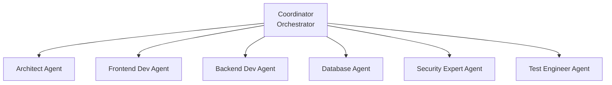

# L6-1: Multi-Agent Collaboration Overview

> From working alone to teamwork - letting multiple AI Agents work together to solve complex problems

## Section Overview

The capabilities of a single AI Agent are limited, just as one person struggles to complete a large project. When facing complex tasks, we need **multiple Agents to work together**, each leveraging their expertise to achieve common goals.

This lesson will cover:
- Why Multi-Agent collaboration is needed
- Core architecture of Multi-Agent systems
- Common collaboration patterns
- How to design effective Agent teams

---

## 1. From Single Agent to Multi-Agent

### 1.1 Limitations of Single Agent

Imagine one person trying to independently develop an e-commerce platform:

| Task Phase | Capability Assessment |
|------------|----------------------|
| Requirements Analysis | ✅ Can do |
| Architecture Design | ✅ Can do |
| Frontend Development | ✅ Can do |
| Backend Development | ✅ Can do |
| Database Design | ✅ Can do |
| Payment Integration | △ Limited knowledge |
| Security Audit | △ Not deep enough |
| Performance Optimization | △ Easy to miss |
| Test Coverage | △ Hard to be comprehensive |

**Result: Jack of all trades, master of none**
- Context overload, easy to forget
- Insufficient professional depth
- Inconsistent quality

**Specific Problems:**
- **Context Limitations**: Difficult to remember all details of the entire project
- **Professional Depth**: Not deep enough understanding in each domain
- **Consistency**: Different code styles and quality across sections
- **Efficiency**: Serial processing, time-consuming

### 1.2 Advantages of Multi-Agent



**Result: Professional division, collaborative completion**
- Each Agent focuses on its area
- Parallel processing, improved efficiency
- Mutual review, quality assurance

**Core Value:**

| Dimension | Single Agent | Multi-Agent |
|-----------|--------------|-------------|
| **Professional Depth** | Broad but shallow | Deep expertise in each area |
| **Task Parallelism** | Serial execution | Multi-task parallelism |
| **Quality Assurance** | Self-checking | Mutual review |
| **Scalability** | Limited by context | Can dynamically add Agents |
| **Complexity Handling** | Suitable for simple tasks | Can handle complex projects |

---

## 2. Multi-Agent System Architecture

### 2.1 Core Components

```
┌─────────────────────────────────────────────────────────────┐
│                Multi-Agent System Architecture               │
├─────────────────────────────────────────────────────────────┤
│                                                             │
│  ┌──────────────────────────────────────────────────────┐  │
│  │                   Orchestration Layer                 │  │
│  │  ┌─────────────┐  ┌─────────────┐  ┌─────────────┐  │  │
│  │  │ Task Decom- │  │ Task Assign-│  │ Result      │  │  │
│  │  │ position    │  │ ment        │  │ Integration│  │  │
│  │  └─────────────┘  └─────────────┘  └─────────────┘  │  │
│  └──────────────────────────────────────────────────────┘  │
│                                                             │
│  ┌──────────────────────────────────────────────────────┐  │
│  │                   Communication Layer                 │  │
│  │  ┌─────────────┐  ┌─────────────┐  ┌─────────────┐  │  │
│  │  │ Message     │  │ State       │  │ Conflict   │  │  │
│  │  │ Queue       │  │ Sync        │  │ Resolution │  │  │
│  │  └─────────────┘  └─────────────┘  └─────────────┘  │  │
│  └──────────────────────────────────────────────────────┘  │
│                                                             │
│  ┌──────────────────────────────────────────────────────┐  │
│  │                   Agent Layer                         │  │
│  │  ┌─────────┐ ┌─────────┐ ┌─────────┐ ┌─────────┐   │  │
│  │  │ Agent 1 │ │ Agent 2 │ │ Agent 3 │ │ Agent N │   │  │
│  │  │Architect│ │ Developer│ │ Reviewer│ │ Tester  │   │  │
│  │  └─────────┘ └─────────┘ └─────────┘ └─────────┘   │  │
│  └──────────────────────────────────────────────────────┘  │
│                                                             │
│  ┌──────────────────────────────────────────────────────┐  │
│  │                   Shared Resources Layer             │  │
│  │  ┌─────────────┐  ┌─────────────┐  ┌─────────────┐  │  │
│  │  │ Knowledge   │  │ Code        │  │ Spec        │  │  │
│  │  │ Base        │  │ Repository  │  │ Documents   │  │  │
│  │  └─────────────┘  └─────────────┘  └─────────────┘  │  │
│  └──────────────────────────────────────────────────────┘  │
│                                                             │
└─────────────────────────────────────────────────────────────┘
```

### 2.2 Orchestrator

**Responsibilities:**
- Receive user requests
- Decompose tasks
- Assign to appropriate Agents
- Monitor execution progress
- Integrate final results

**Workflow:**

```
User Request
    │
    ▼
┌──────────┐    ┌──────────┐    ┌──────────┐
│ Task     │───→│ Task     │───→│ Dependency│
│ Understanding│ Decomposition│ Analysis │
└──────────┘    └──────────┘    └──────────┘
                                       │
                                       ▼
                              ┌──────────┐
                              │ Make Plan│
                              │ (DAG)    │
                              └────┬─────┘
                                   │
                    ┌──────────────┼──────────────┐
                    │              │              │
                    ▼              ▼              ▼
              ┌──────────┐  ┌──────────┐  ┌──────────┐
              │ Agent A │  │ Agent B │  │ Agent C │
              │ Parallel │  │ Parallel │  │ Parallel │
              │ Execute  │  │ Execute  │  │ Execute  │
              └────┬─────┘  └────┬─────┘  └────┬─────┘
                   │              │              │
                   └──────────────┼──────────────┘
                                  │
                                  ▼
                           ┌──────────┐
                           │ Result  │
                           │ Integration│
                           └────┬─────┘
                                │
                                ▼
                           ┌──────────┐
                           │ Quality  │
                           │ Check   │
                           └────┬─────┘
                                │
                                ▼
                           ┌──────────┐
                           │ Return  │
                           │ to User │
                           └──────────┘
```

### 2.3 Agent Communication Mechanisms

**Communication Patterns:**

```
Pattern 1: Direct Communication        Pattern 2: Via Message Bus
┌─────────┐      ┌─────────┐       ┌─────────┐      ┌─────────┐
│ Agent A │←────→│ Agent B │       │ Agent A │─────→│ Message │
└─────────┘      └─────────┘       └─────────┘      │   Bus   │
                                                    └────┬────┘
                                                         │
                              ┌─────────┐      ┌────────┴────────┐
                              │ Agent C │←─────│ Message         │
                              └─────────┘      │ Distribution    │
                                               └─────────────────┘

Pattern 3: Publish-Subscribe           Pattern 4: Request-Response
┌─────────┐                          ┌─────────┐      ┌─────────┐
│ Agent A │──Publish──→ Topic X       │ Agent A │──Request──→│ Agent B │
└─────────┘                          └─────────┘      └────┬────┘
     │                                               │
     ↓                                               ↓
┌─────────┐                          ┌─────────┐      ┌─────────┐
│ Agent B │←──Subscribe── Topic X    │ Agent C │      │Response │
└─────────┘                          └─────────┘      └─────────┘
┌─────────┐
│ Agent C │←──Subscribe── Topic X
└─────────┘
```

---

## 3. Common Collaboration Patterns

### 3.1 Pipeline Pattern

**Applicable Scenarios:** Tasks with clear sequential steps

```
┌──────────┐    ┌──────────┐    ┌──────────┐    ┌──────────┐
│Requirement│───→│Architecture│───→│Code      │───→│Testing   │
│ Analysis │    │ Design   │    │ Development│   │ Validation│
│  Agent   │    │  Agent   │    │  Agent    │    │  Agent    │
└──────────┘    └──────────┘    └──────────┘    └──────────┘
     │               │               │               │
     ▼               ▼               ▼               ▼
  PRD Doc       Technical      Code           Test Report
                 Spec          Implementation
```

**Example: Code Generation Pipeline**

```yaml
workflow:
  name: code_generation_pipeline

  steps:
    - name: requirement_analysis
      agent: requirement_analyst
      input: user_request
      output: prd_document

    - name: architecture_design
      agent: architect
      input: prd_document
      output: tech_spec

    - name: interface_design
      agent: interface_designer
      input: tech_spec
      output: api_contract

    - name: implementation
      agent: developer
      input: [tech_spec, api_contract]
      output: code

    - name: code_review
      agent: code_reviewer
      input: code
      output: review_report

    - name: testing
      agent: tester
      input: [code, review_report]
      output: test_report
```

### 3.2 Divide and Conquer Pattern

**Applicable Scenarios:** Tasks that can be decomposed into independent subtasks

```
                    ┌──────────┐
                    │Coordinator│
                    └────┬─────┘
                         │
         ┌───────────────┼───────────────┐
         │               │               │
         ▼               ▼               ▼
    ┌──────────┐   ┌──────────┐   ┌──────────┐
    │ Agent A  │   │ Agent B  │   │ Agent C  │
    │ User     │   │ Product  │   │ Order    │
    │ Module   │   │ Module   │   │ Module   │
    └────┬─────┘   └────┬─────┘   └────┬─────┘
         │               │               │
         └───────────────┼───────────────┘
                         │
                         ▼
                    ┌──────────┐
                    │ Result   │
                    │ Integration│
                    └──────────┘
```

### 3.3 Discussion Pattern

**Applicable Scenarios:** Need multiple rounds of discussion to reach consensus

```
┌──────────┐         ┌──────────┐         ┌──────────┐
│ Proposer │────────→│ Evaluator│────────→│ Decider  │
│ Agent    │         │ Agent    │         │ Agent    │
│ "I       │         │ "Pros &  │         │ "Decision"│
│ suggest" │         │ Cons"    │         │          │
└──────────┘         └──────────┘         └──────────┘
     ↑                                        │
     └────────────────────────────────────────┘
              "Feedback Iteration"
```

**Example: Technical Proposal Discussion**

```
Round 1:
Architect Agent: Propose microservices architecture
    ↓
Evaluator Agent: Analyze pros and cons
  - Pros: Good scalability
  - Cons: High complexity, large ops overhead
    ↓
Decider Agent: Suggest starting with monolith, splitting later
    ↓
Architect Agent: Accept suggestion, modify proposal

Round 2:
Architect Agent: Present modified proposal
    ↓
... (until consensus is reached)
```

### 3.4 Competition Pattern

**Applicable Scenarios:** Need multiple proposals for comparison and selection

```
                    ┌──────────┐
                    │  Task   │
                    └────┬─────┘
                         │
         ┌───────────────┼───────────────┐
         │               │               │
         ▼               ▼               ▼
    ┌──────────┐   ┌──────────┐   ┌──────────┐
    │ Agent A  │   │ Agent B  │   │ Agent C  │
    │ Proposal1│   │ Proposal2│   │ Proposal3│
    └────┬─────┘   └────┬─────┘   └────┬─────┘
         │               │               │
         └───────────────┼───────────────┘
                         │
                         ▼
                    ┌──────────┐
                    │Evaluator │
                    │ Agent    │
                    │ Select   │
                    │ Best     │
                    └──────────┘
```

### 3.5 Pattern Comparison

| Pattern | Applicable Scenario | Advantages | Disadvantages |
|---------|---------------------|------------|---------------|
| **Pipeline** | Tasks with clear steps | Clear structure, easy to manage | Low flexibility, cannot parallelize |
| **Divide and Conquer** | Decomposable independent tasks | Efficient parallelism | Requires good task decomposition |
| **Discussion** | Need consensus | Comprehensive consideration, high quality | Time-consuming |
| **Competition** | Need multiple proposals comparison | Diverse proposals, can select best | High resource consumption |

---

## 4. Agent Role Design

### 4.1 Common Role Definitions

```yaml
agents:
  # Product Manager
  product_manager:
    name: "Product Manager"
    responsibility: "Requirements analysis, Feature planning"
    skills:
      - User story writing
      - Requirements prioritization
      - Product documentation
    output:
      - PRD documents
      - User stories
      - Feature lists

  # Architect
  architect:
    name: "Architect"
    responsibility: "System design, Technology selection"
    skills:
      - System architecture design
      - Technology evaluation
      - Performance planning
    output:
      - Architecture documents
      - Technical specifications
      - API design

  # Frontend Developer
  frontend_dev:
    name: "Frontend Developer"
    responsibility: "Frontend implementation"
    skills:
      - React/Vue development
      - UI component implementation
      - State management
    output:
      - Frontend code
      - Component documentation

  # Backend Developer
  backend_dev:
    name: "Backend Developer"
    responsibility: "Backend implementation"
    skills:
      - API development
      - Database design
      - Business logic implementation
    output:
      - Backend code
      - API documentation

  # Code Reviewer
  code_reviewer:
    name: "Code Reviewer"
    responsibility: "Code quality inspection"
    skills:
      - Code standards checking
      - Security vulnerability detection
      - Performance issue identification
    output:
      - Review reports
      - Improvement suggestions

  # Test Engineer
  tester:
    name: "Test Engineer"
    responsibility: "Quality assurance"
    skills:
      - Test case design
      - Automated testing
      - Bug reporting
    output:
      - Test cases
      - Test reports
```

### 4.2 Role Collaboration Relationships

```
┌─────────────────────────────────────────────────────────────┐
│                    Agent Collaboration Diagram               │
├─────────────────────────────────────────────────────────────┤
│                                                             │
│   Product Mgr ──→ Architect ──→ Frontend ──→ Code ──→ Test │
│      │           │           │           │           │     │
│      └───────────┴───────────┴───────────┴───────────┘     │
│                         ↑                                   │
│                    Coordinator                              │
│                    (Orchestrator)                           │
│                                                             │
│   Collaboration Rules:                                      │
│   1. Each Agent only receives output from upstream Agents   │
│   2. Each Agent's output must be reviewed before passing   │
│      to downstream                                           │
│   3. When issues are found, can roll back to upstream      │
│      for reprocessing                                       │
│                                                             │
└─────────────────────────────────────────────────────────────┘
```

---

## 5. Practice: Designing a Development Team

### 5.1 Team Configuration

**Project:** Develop a task management system

**Team Composition:**

```yaml
team:
  name: "TaskFlow Development Team"

  orchestrator:
    name: "Project Manager"
    model: "gpt-4"
    system_prompt: |
      You are the project manager responsible for coordinating
      the development team to complete the project.
      Your responsibilities:
      1. Understand user requirements
      2. Decompose tasks and assign to appropriate Agents
      3. Monitor progress and handle blockers
      4. Integrate outputs from all Agents
      5. Ensure final delivery quality

  agents:
    - name: "Requirements Analyst"
      role: "Analyze user requirements, write PRD"
      model: "gpt-4"
      knowledge:
        - product-management
        - user-story-writing

    - name: "Architect"
      role: "Design system architecture"
      model: "gpt-4"
      knowledge:
        - system-design
        - database-design
        - api-design

    - name: "Frontend Developer"
      role: "Implement frontend functionality"
      model: "gpt-4"
      knowledge:
        - react
        - typescript
        - ui-design
      tools:
        - file_system
        - code_generator

    - name: "Backend Developer"
      role: "Implement backend functionality"
      model: "gpt-4"
      knowledge:
        - nodejs
        - database
        - rest-api
      tools:
        - file_system
        - code_generator

    - name: "Code Reviewer"
      role: "Review code quality"
      model: "gpt-4"
      knowledge:
        - code-review
        - security
        - performance

    - name: "Test Engineer"
      role: "Write and execute tests"
      model: "gpt-4"
      knowledge:
        - testing
        - jest
        - cypress
```

### 5.2 Workflow Definition

```yaml
workflow:
  name: "TaskFlow Development Process"

  triggers:
    - user_request

  steps:
    # Phase 1: Requirements Analysis
    - id: analyze_requirements
      name: "Requirements Analysis"
      agent: "Requirements Analyst"
      input: user_request
      output: prd_document

    # Phase 2: Architecture Design
    - id: design_architecture
      name: "Architecture Design"
      agent: "Architect"
      input: prd_document
      output: architecture_document
      depends_on: [analyze_requirements]

    # Phase 3: Parallel Development
    - id: develop_frontend
      name: "Frontend Development"
      agent: "Frontend Developer"
      input: [prd_document, architecture_document]
      output: frontend_code
      depends_on: [design_architecture]

    - id: develop_backend
      name: "Backend Development"
      agent: "Backend Developer"
      input: [prd_document, architecture_document]
      output: backend_code
      depends_on: [design_architecture]

    # Phase 4: Code Review (Parallel)
    - id: review_frontend
      name: "Frontend Code Review"
      agent: "Code Reviewer"
      input: frontend_code
      output: frontend_review
      depends_on: [develop_frontend]

    - id: review_backend
      name: "Backend Code Review"
      agent: "Code Reviewer"
      input: backend_code
      output: backend_review
      depends_on: [develop_backend]

    # Phase 5: Fix Issues (if needed)
    - id: fix_frontend
      name: "Frontend Issue Fix"
      agent: "Frontend Developer"
      input: [frontend_code, frontend_review]
      output: frontend_code_v2
      depends_on: [review_frontend]
      condition: "has_issues(frontend_review)"

    - id: fix_backend
      name: "Backend Issue Fix"
      agent: "Backend Developer"
      input: [backend_code, backend_review]
      output: backend_code_v2
      depends_on: [review_backend]
      condition: "has_issues(backend_review)"

    # Phase 6: Testing
    - id: run_tests
      name: "Execute Tests"
      agent: "Test Engineer"
      input: [frontend_code_v2, backend_code_v2]
      output: test_report
      depends_on: [fix_frontend, fix_backend]

    # Phase 7: Final Delivery
    - id: deliver
      name: "Project Delivery"
      agent: "Project Manager"
      input: [prd_document, architecture_document, frontend_code_v2, backend_code_v2, test_report]
      output: delivery_package
      depends_on: [run_tests]
```

### 5.3 Execution Flow Visualization

```
Timeline ──────────────────────────────────────────────────────>

Requirements    [========]
                   ↓
Architecture       [========]
                   ↓
Frontend Dev       [========]          [====] (Fix)
                   ↓                    ↓
Backend Dev       [========]          [====] (Fix)
                   ↓                    ↓
Frontend Review      [====]
                   ↓
Backend Review      [====]
                   ↓
Testing                 [========]
                   ↓
Delivery                    [====]

Parallel execution: Frontend and Backend development run simultaneously
Dependencies: Development starts only after architecture design is complete
Iterative fixes: Issues found in review go back for fixes
```

---

## 6. Challenges and Solutions

### 6.1 Common Challenges

| Challenge | Description | Solution |
|-----------|-------------|----------|
| **Context Sync** | Inconsistent information between Agents | Shared knowledge base, unified state management |
| **Conflict Resolution** | Multiple Agents disagree | Voting mechanism, coordinator arbitration |
| **Circular Dependency** | Agent A waits for B, B waits for A | Dependency graph detection, break cycles |
| **Inconsistent Quality** | Different output quality from different Agents | Review mechanism, quality standards |
| **High Cost** | Multiple Agent calls expensive | Task merging, selective usage |

### 6.2 Best Practices

1. **Clearly Define Role Boundaries**
   - Each Agent has clear responsibility scope
   - Avoid overlapping responsibilities

2. **Establish Standardized Interfaces**
   - Unified input/output formats
   - Standardized message protocols

3. **Implement Quality Gates**
   - Each phase's output must be checked
   - Return for reprocessing if unqualified

4. **Maintain Complete Logs**
   - Track reasons for each decision
   - Facilitate problem solving and optimization

5. **Support Human Intervention**
   - Key decisions require human confirmation
   - Exceptional situations handled by humans

---

## 7. Section Summary

### Core Concepts

1. **Multi-Agent Collaboration** enables multiple specialized Agents to work together on complex tasks

2. **Core Architecture**: Orchestration Layer + Communication Layer + Agent Layer + Shared Resources Layer

3. **Collaboration Patterns**: Pipeline, Divide and Conquer, Discussion, Competition - choose based on scenario

4. **Role Design**: Clearly define each Agent's responsibilities, skills, and outputs

### Key Takeaways

- Single Agent has context and professional depth limitations
- Multi-Agent solves complex problems through division of labor and collaboration
- The Coordinator is the core of the system, responsible for task allocation and progress monitoring
- Choosing the right collaboration pattern is important

### Next Steps

In the next lesson [L6-2: Task Decomposition and Assignment](/tutorial/L6-2), we will:
- Learn how to decompose complex tasks into subtasks
- Master algorithms and strategies for task assignment
- Understand dependency management and scheduling optimization
- Practice: Implement a task scheduler

---

-> [6.2 Task Decomposition and Assignment](/tutorial/L6-2)
