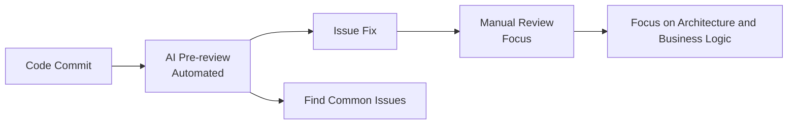

# L7-1: AI Code Review Overview

> Let AI become your code review assistant and improve code quality

## Section Overview

Code review is a critical step in ensuring code quality, but manual review is time-consuming and prone to missing issues. AI code review can work 24/7 without interruption, identify potential problems, and provide fix suggestions. This lesson will introduce the value, types, and implementation methods of AI code review.

By the end of this lesson, you will learn:
- Core value of AI code review
- Different types of code review
- Review dimensions and checklists
- How to design a review workflow

---

## 1. Why AI Code Review is Needed

### 1.1 Challenges of Traditional Code Review

| Challenge | Description |
|-----------|-------------|
| **1. High time cost** | Reviewing 1000 lines of code takes 2-4 hours<br>Large PRs may take days to review |
| **2. Easy to miss issues** | Human eyes get fatigued<br>Complex logic is difficult to analyze comprehensively |
| **3. Inconsistent quality** | Different reviewers have different standards<br>Experience gaps lead to varying review depth |
| **4. Difficult knowledge transfer** | Review comments are hard to systematize<br>High learning curve for new team members |

### 1.2 Advantages of AI Code Review

| Dimension | Manual Review | AI Review |
|-----------|---------------|-----------|
| **Speed** | 100-200 lines/hour | 1000+ lines/minute |
| **Consistency** | Affected by reviewer state | Uniform standards |
| **Coverage** | Easy to miss edge cases | Comprehensive scanning |
| **Knowledge accumulation** | Difficult to systematize | Automatic沉淀 |
| **Availability** | Working hours | 24/7 |
| **Cost** | High labor cost | Low marginal cost |

### 1.3 AI + Manual Collaboration Mode

**Best Practice: AI Pre-review + Manual Final Review**



**Division of Work**:
- **AI**: Syntax errors, security vulnerabilities, performance issues, code standards
- **Manual**: Architecture design, business logic, maintainability

---

## 2. Code Review Types

### 2.1 Classification by Review Timing

```
Review Timing:

1. Pre-commit Review
   Runs automatically before git commit
   - Code standards check
   - Basic security scan
   - Quick feedback

2. Post-commit Review
   Runs after code is pushed to repository
   - Deep security analysis
   - Performance detection
   - Generate review report

3. Pull Request Review
   Runs when PR is created
   - Complete code review
   - Compare against baseline branch
   - Generate review comments

4. Scheduled Review
   Runs on schedule (e.g., every night)
   - Full repository scan
   - Technical debt detection
   - Trend analysis
```

### 2.2 Classification by Review Dimension

| Type | Focus | Examples |
|------|-------|----------|
| **Security Review** | Vulnerabilities, risks | SQL injection, XSS, sensitive data leakage |
| **Performance Review** | Efficiency, resources | N+1 queries, memory leaks, algorithm complexity |
| **Standards Review** | Style, standards | Naming conventions, code formatting, comments |
| **Architecture Review** | Design, structure | Coupling, cohesion, design patterns |
| **Maintainability** | Readability, testing | Complexity, duplicate code, test coverage |

---

## 3. Review Dimensions in Detail

### 3.1 Security Review

**Common Security Issues:**

```javascript
// ❌ SQL injection risk
const query = `SELECT * FROM users WHERE id = ${userId}`;

// ✅ Safe parameterized query
const query = 'SELECT * FROM users WHERE id = ?';
db.query(query, [userId]);

// ❌ XSS risk
element.innerHTML = userInput;

// ✅ Safe text insertion
element.textContent = userInput;

// ❌ Hardcoded sensitive information
const apiKey = 'sk-1234567890abcdef';

// ✅ Use environment variables
const apiKey = process.env.API_KEY;
```

**Security Review Checklist:**

- [ ] Input validation and filtering
- [ ] SQL injection protection
- [ ] XSS protection
- [ ] CSRF protection
- [ ] Sensitive information protection
- [ ] Access control
- [ ] Dependency vulnerability scanning

### 3.2 Performance Review

**Common Performance Issues:**

```javascript
// ❌ N+1 query problem
const users = await User.findAll();
for (const user of users) {
  const orders = await Order.find({ userId: user.id }); // N queries!
}

// ✅ Use JOIN or eager loading
const users = await User.findAll({
  include: [{ model: Order }]
});

// ❌ Unnecessary re-renders
function Component({ data }) {
  const processed = heavyComputation(data); // Runs every render
  return <div>{processed}</div>;
}

// ✅ Use useMemo for caching
function Component({ data }) {
  const processed = useMemo(() => heavyComputation(data), [data]);
  return <div>{processed}</div>;
}
```

**Performance Review Checklist:**

- [ ] Database query optimization
- [ ] Algorithm complexity analysis
- [ ] Memory usage check
- [ ] Render performance optimization
- [ ] Resource loading optimization
- [ ] Cache strategy

### 3.3 Standards Review

**Code Standards Examples:**

```typescript
// ❌ Non-standard naming
function getdata() { }
let user_name: string;

// ✅ Standards-compliant naming
function getUserData() { }
let userName: string;

// ❌ Missing type definitions
function process(data) {
  return data.map(x => x * 2);
}

// ✅ Complete type definitions
function process(data: number[]): number[] {
  return data.map(x => x * 2);
}

// ❌ Magic numbers
if (status === 3) { }

// ✅ Use constants
const STATUS_COMPLETED = 3;
if (status === STATUS_COMPLETED) { }
```

**Standards Review Checklist:**

- [ ] Naming conventions
- [ ] Code formatting
- [ ] Type definitions
- [ ] Comment quality
- [ ] File organization
- [ ] Import sorting

---

## 4. Review Workflow Design

### 4.1 Layered Review Strategy

```
Layered Review Model:

Layer 1: Automated Tools (millisecond level)
├── ESLint / Prettier
├── TypeScript type checking
└── Basic security scanning

Layer 2: AI Review (second level)
├── Security vulnerability detection
├── Performance issue identification
├── Code standards checking
└── Best practices suggestions

Layer 3: Manual Review (minute level)
├── Architecture design review
├── Business logic verification
└── Maintainability assessment

Layer 4: Team Review (hour level)
├── Design proposal discussion
├── Knowledge sharing
└── Experience transfer
```

### 4.2 Review Process Design

```yaml
# code-review-workflow.yaml
workflow:
  name: "Layered Code Review Process"
  
  triggers:
    - type: pre-commit
      actions: [lint, type-check]
    
    - type: post-commit
      actions: [security-scan, ai-review]
    
    - type: pull-request
      actions: [full-review]
  
  stages:
    - name: "Automated Checks"
      tools:
        - eslint
        - prettier
        - tsc
      blocking: true
      
    - name: "AI Pre-review"
      ai_agents:
        - security-reviewer
        - performance-reviewer
        - style-reviewer
      blocking: false
      
    - name: "Manual Review"
      required_reviewers: 2
      blocking: true
      
    - name: "Final Approval"
      approvers:
        - tech-lead
        - architect
```

### 4.3 Review Report Template

```markdown
# Code Review Report

## Basic Information
- **Review Target**: [PR Link]
- **Review Time**: 2024-01-15
- **Review Tool**: AI Code Reviewer v2.0
- **Code Scale**: 1500 lines changed

## Review Summary

| Level | Count | Status |
|-------|-------|--------|
| 🔴 Critical | 2 | Needs Fix |
| 🟡 Warning | 5 | Recommended Fix |
| 🟢 Suggestion | 12 | Optional |

## Critical Issues (Needs Immediate Fix)

### 1. SQL Injection Risk
- **Location**: `src/services/user.ts:45`
- **Issue**: User input directly concatenated into SQL query
- **Risk**: Attackers may gain database access
- **Fix Suggestion**:
  ```typescript
  // Before fix
  const query = `SELECT * FROM users WHERE name = '${name}'`;
  
  // After fix
  const query = 'SELECT * FROM users WHERE name = ?';
  db.query(query, [name]);
  ```

## Warnings (Recommended Fix)

### 1. Performance Issue: N+1 Query
- **Location**: `src/controllers/order.ts:23`
- **Issue**: Database queries in loop
- **Suggestion**: Use JOIN or batch queries

## Code Standards

### Compliant ✅
- Naming conventions
- Type definitions
- Error handling

### Needs Improvement ⚠️
- Missing JSDoc comments (3 places)
- Insufficient test coverage (current 65%, recommended 80%)

## Positive Feedback

- ✅ Good error handling mechanism
- ✅ Appropriate use of design patterns
- ✅ Clear code structure

## Action Items

- [ ] Fix SQL injection issue
- [ ] Optimize N+1 query
- [ ] Add unit tests
- [ ] Add JSDoc comments

## Review Conclusion

**Status**: ⚠️ Needs Modification

Please resubmit for review after fixing critical issues.
```

---

## 5. Section Summary

### Core Concepts

1. **AI Code Review** can significantly improve review efficiency, but should not completely replace manual review

2. **Best Mode** is layered collaboration with AI pre-review + manual final review

3. **Review Dimensions** include security, performance, standards, architecture, and maintainability

4. **Workflow Design** should be layered and progressive, from automation to manual

### Review Checklist

**Pre-commit:**
- [ ] Code standards check passed
- [ ] Type check passed
- [ ] Basic security scan passed

**PR Review:**
- [ ] AI review has no critical issues
- [ ] Manual review passed
- [ ] Test coverage meets standards

### Next Steps

In the next lesson [L7-2: Designing Professional Review Skills](/tutorial/L7-2), we will:
- Learn how to design professional code review Skills
- Master review Prompt writing techniques
- Understand how to customize review rules
- Practice: Develop a security review Skill

---

→ [7.2 Designing Professional Review Skills](/tutorial/L7-2)
