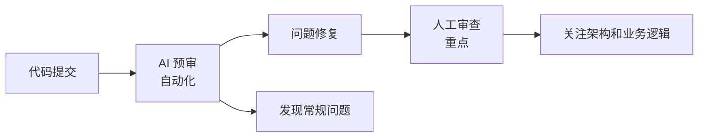

# L7-1: AI 代码审查概述

> 让 AI 成为你的代码审查助手，提升代码质量

## 本节导读

代码审查是保证代码质量的关键环节，但人工审查耗时且容易遗漏。AI 代码审查可以 24/7 不间断工作，发现潜在问题，提供修复建议。本节课将介绍 AI 代码审查的价值、类型和实施方法。

通过本节课，你将学会：
- AI 代码审查的核心价值
- 不同类型的代码审查
- 审查维度和检查清单
- 如何设计审查工作流

---

## 一、为什么需要 AI 代码审查

### 1.1 传统代码审查的挑战

| 挑战 | 说明 |
|------|------|
| **1. 时间成本高** | 审查 1000 行代码需要 2-4 小时<br>大型 PR 可能需要数天审查 |
| **2. 容易遗漏问题** | 人眼容易疲劳<br>复杂逻辑难以全面分析 |
| **3. 质量不一致** | 不同审查者标准不同<br>经验差异导致审查深度不一 |
| **4. 知识传递困难** | 审查意见难以系统化积累<br>新人学习成本高 |

### 1.2 AI 代码审查的优势

| 维度 | 人工审查 | AI 审查 |
|------|----------|---------|
| **速度** | 100-200 行/小时 | 1000+ 行/分钟 |
| **一致性** | 受审查者状态影响 | 标准统一 |
| **覆盖度** | 容易遗漏边界情况 | 全面扫描 |
| **知识积累** | 难以系统化 | 自动沉淀 |
| **可用性** | 工作时间 | 24/7 |
| **成本** | 人力成本高 | 边际成本低 |

### 1.3 AI + 人工协作模式

**最佳实践：AI 预审 + 人工终审**



**分工**：
- **AI**：语法错误、安全漏洞、性能问题、代码规范
- **人工**：架构设计、业务逻辑、可维护性

---

## 二、代码审查类型

### 2.1 按审查时机分类

```
审查时机：

1. 提交前审查（Pre-commit）
   git commit 之前自动运行
   - 代码规范检查
   - 基础安全扫描
   - 快速反馈

2. 提交后审查（Post-commit）
   代码推送到仓库后运行
   - 深度安全分析
   - 性能检测
   - 生成审查报告

3. PR 审查（Pull Request）
   创建 PR 时运行
   - 完整代码审查
   - 对比基线分支
   - 生成审查意见

4. 定期审查（Scheduled）
   定时运行（如每晚）
   - 全仓库扫描
   - 技术债务检测
   - 趋势分析
```

### 2.2 按审查维度分类

| 类型 | 关注点 | 示例 |
|------|--------|------|
| **安全审查** | 漏洞、风险 | SQL 注入、XSS、敏感信息泄露 |
| **性能审查** | 效率、资源 | N+1 查询、内存泄漏、算法复杂度 |
| **规范审查** | 风格、标准 | 命名规范、代码格式、注释 |
| **架构审查** | 设计、结构 | 耦合度、内聚性、设计模式 |
| **可维护性** | 可读性、测试 | 复杂度、重复代码、测试覆盖 |

---

## 三、审查维度详解

### 3.1 安全审查

**常见安全问题：**

```javascript
// ❌ SQL 注入风险
const query = `SELECT * FROM users WHERE id = ${userId}`;

// ✅ 安全的参数化查询
const query = 'SELECT * FROM users WHERE id = ?';
db.query(query, [userId]);

// ❌ XSS 风险
element.innerHTML = userInput;

// ✅ 安全的文本插入
element.textContent = userInput;

// ❌ 敏感信息硬编码
const apiKey = 'sk-1234567890abcdef';

// ✅ 使用环境变量
const apiKey = process.env.API_KEY;
```

**安全审查检查清单：**

- [ ] 输入验证和过滤
- [ ] SQL 注入防护
- [ ] XSS 防护
- [ ] CSRF 防护
- [ ] 敏感信息保护
- [ ] 权限控制
- [ ] 依赖漏洞扫描

### 3.2 性能审查

**常见性能问题：**

```javascript
// ❌ N+1 查询问题
const users = await User.findAll();
for (const user of users) {
  const orders = await Order.find({ userId: user.id }); // N 次查询！
}

// ✅ 使用 JOIN 或预加载
const users = await User.findAll({
  include: [{ model: Order }]
});

// ❌ 不必要的重渲染
function Component({ data }) {
  const processed = heavyComputation(data); // 每次渲染都执行
  return <div>{processed}</div>;
}

// ✅ 使用 useMemo 缓存
function Component({ data }) {
  const processed = useMemo(() => heavyComputation(data), [data]);
  return <div>{processed}</div>;
}
```

**性能审查检查清单：**

- [ ] 数据库查询优化
- [ ] 算法复杂度分析
- [ ] 内存使用检查
- [ ] 渲染性能优化
- [ ] 资源加载优化
- [ ] 缓存策略

### 3.3 规范审查

**代码规范示例：**

```typescript
// ❌ 命名不规范
function getdata() { }
let user_name: string;

// ✅ 规范的命名
function getUserData() { }
let userName: string;

// ❌ 缺少类型定义
function process(data) {
  return data.map(x => x * 2);
}

// ✅ 完整的类型定义
function process(data: number[]): number[] {
  return data.map(x => x * 2);
}

// ❌ 魔法数字
if (status === 3) { }

// ✅ 使用常量
const STATUS_COMPLETED = 3;
if (status === STATUS_COMPLETED) { }
```

**规范审查检查清单：**

- [ ] 命名规范
- [ ] 代码格式
- [ ] 类型定义
- [ ] 注释质量
- [ ] 文件组织
- [ ] 导入排序

---

## 四、审查工作流设计

### 4.1 分层审查策略

```
分层审查模型：

Layer 1: 自动化工具（毫秒级）
├── ESLint / Prettier
├── TypeScript 类型检查
└── 基础安全扫描

Layer 2: AI 审查（秒级）
├── 安全漏洞检测
├── 性能问题识别
├── 代码规范检查
└── 最佳实践建议

Layer 3: 人工审查（分钟级）
├── 架构设计审查
├── 业务逻辑验证
└── 可维护性评估

Layer 4: 团队评审（小时级）
├── 设计方案讨论
├── 知识分享
└── 经验传承
```

### 4.2 审查流程设计

```yaml
# code-review-workflow.yaml
workflow:
  name: "分层代码审查流程"
  
  triggers:
    - type: pre-commit
      actions: [lint, type-check]
    
    - type: post-commit
      actions: [security-scan, ai-review]
    
    - type: pull-request
      actions: [full-review]
  
  stages:
    - name: "自动化检查"
      tools:
        - eslint
        - prettier
        - tsc
      blocking: true
      
    - name: "AI 预审"
      ai_agents:
        - security-reviewer
        - performance-reviewer
        - style-reviewer
      blocking: false
      
    - name: "人工审查"
      required_reviewers: 2
      blocking: true
      
    - name: "最终批准"
      approvers:
        - tech-lead
        - architect
```

### 4.3 审查报告模板

```markdown
# 代码审查报告

## 基本信息
- **审查对象**: [PR 链接]
- **审查时间**: 2024-01-15
- **审查工具**: AI Code Reviewer v2.0
- **代码规模**: 1500 行变更

## 审查摘要

| 级别 | 数量 | 状态 |
|------|------|------|
| 🔴 严重 | 2 | 需修复 |
| 🟡 警告 | 5 | 建议修复 |
| 🟢 建议 | 12 | 可选 |

## 严重问题（需立即修复）

### 1. SQL 注入风险
- **位置**: `src/services/user.ts:45`
- **问题**: 用户输入直接拼接到 SQL 查询
- **风险**: 攻击者可能获取数据库权限
- **修复建议**:
  ```typescript
  // 修复前
  const query = `SELECT * FROM users WHERE name = '${name}'`;
  
  // 修复后
  const query = 'SELECT * FROM users WHERE name = ?';
  db.query(query, [name]);
  ```

## 警告（建议修复）

### 1. 性能问题：N+1 查询
- **位置**: `src/controllers/order.ts:23`
- **问题**: 循环中查询数据库
- **建议**: 使用 JOIN 或批量查询

## 代码规范

### 符合规范 ✅
- 命名规范
- 类型定义
- 错误处理

### 需要改进 ⚠️
- 缺少 JSDoc 注释（3 处）
- 测试覆盖率不足（当前 65%，建议 80%）

## 正面评价

- ✅ 良好的错误处理机制
- ✅ 使用了适当的设计模式
- ✅ 代码结构清晰

## 行动项

- [ ] 修复 SQL 注入问题
- [ ] 优化 N+1 查询
- [ ] 补充单元测试
- [ ] 添加 JSDoc 注释

## 审查结论

**状态**: ⚠️ 需要修改

请在修复严重问题后重新提交审查。
```

---

## 五、本节小结

### 核心概念

1. **AI 代码审查** 可以大幅提升审查效率，但不应完全替代人工审查

2. **最佳模式** 是 AI 预审 + 人工终审的分层协作

3. **审查维度** 包括安全、性能、规范、架构、可维护性

4. **工作流设计** 应该分层递进，从自动化到人工

### 审查检查清单

**提交前：**
- [ ] 代码规范检查通过
- [ ] 类型检查通过
- [ ] 基础安全扫描通过

**PR 审查：**
- [ ] AI 审查无严重问题
- [ ] 人工审查通过
- [ ] 测试覆盖率达标

### 下一步

在下一节课 [L7-2: 设计专业审查 Skill](/tutorial/L7-2) 中，我们将：
- 学习如何设计专业的代码审查 Skill
- 掌握审查提示词的编写技巧
- 了解如何定制审查规则
- 实战：开发一个安全审查 Skill

---

→ [7.2 设计专业审查 Skill](/tutorial/L7-2)
