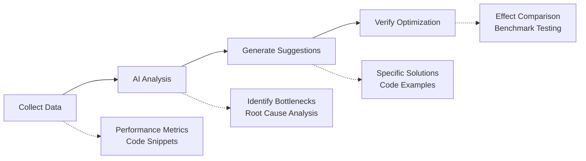

# L8-2: AI-Assisted Performance Analysis

> Let AI become your performance analysis assistant

## Section Overview

AI can help developers quickly identify performance bottlenecks and provide optimization suggestions. This lesson will introduce how to use AI for performance analysis and optimization.

By the end of this lesson, you will learn:
- AI performance analysis methods
- Performance problem diagnosis techniques
- Optimization suggestion generation
- Practice: AI performance analysis assistant

---

## 1. AI Performance Analysis Process

### 1.1 Analysis Process



### 1.2 Data Collection

```javascript
// Collect performance data
const performanceData = {
  // Page load metrics
  navigation: performance.getEntriesByType('navigation')[0],
  
  // Resource load metrics
  resources: performance.getEntriesByType('resource'),
  
  // Long tasks
  longTasks: performance.getEntriesByType('longtask'),
  
  // Memory usage
  memory: performance.memory,
  
  // Code snippets
  codeSnippets: [
    { file: 'App.tsx', lines: '1-50' },
    { file: 'utils.ts', lines: '10-30' }
  ]
};
```

---

## 2. Performance Problem Diagnosis

### 2.1 AI Diagnosis Prompt

```markdown
## Role
You are a performance optimization expert, proficient in frontend and backend performance analysis.

## Task
Analyze the following performance data, identify bottlenecks, and provide optimization suggestions.

## Input Data
```json
{
  "fcp": 2500,
  "lcp": 4200,
  "tti": 5800,
  "longTasks": [
    { "duration": 350, "name": "script-evaluation" }
  ],
  "resources": [
    { "name": "app.js", "size": 850000, "time": 1200 }
  ]
}
```

## Analysis Dimensions
1. Load performance (FCP, LCP)
2. Interaction performance (TTI, FID)
3. Resource optimization (size, caching)
4. Code execution (long tasks, main thread)

## Output Format
### Bottleneck Identification
- Issue description
- Severity
- Impact scope

### Optimization Suggestions
- Specific measures
- Expected effect
- Implementation difficulty
```

### 2.2 Code-Level Performance Analysis

```javascript
// Code to analyze
function processData(data) {
  const result = [];
  for (let i = 0; i < data.length; i++) {
    for (let j = 0; j < data.length; j++) {
      if (data[i].id === data[j].parentId) {
        result.push({
          ...data[i],
          parent: data[j]
        });
      }
    }
  }
  return result;
}

// AI analysis result
const analysis = {
  complexity: 'O(n²)',
  issues: [
    {
      type: 'algorithm',
      description: 'Nested loops result in O(n²) time complexity',
      suggestion: 'Use Map to store parent relationships, optimize to O(n)'
    }
  ],
  optimized: `
function processData(data) {
  const parentMap = new Map(data.map(d => [d.id, d]));
  return data.map(item => ({
    ...item,
    parent: parentMap.get(item.parentId)
  }));
}
  `
};
```

---

## 3. Optimization Suggestion Generation

### 3.1 Frontend Optimization Suggestions

```markdown
## Optimization Suggestion Template

### 1. Resource Optimization
- **Code splitting**: Use dynamic imports
- **Compression**: Enable Gzip/Brotli
- **Caching**: Configure long-term caching strategy

### 2. Render Optimization
- **Virtual list**: Use react-window for large datasets
- **Lazy loading**: Lazy load images and components
- **Debouncing/throttling**: High-frequency event handling

### 3. Network Optimization
- **Preloading**: Prefetch critical resources
- **CDN**: CDN acceleration for static resources
- **HTTP/2**: Enable multiplexing
```

### 3.2 Backend Optimization Suggestions

```markdown
## Database Optimization
- **Index optimization**: Add appropriate indexes
- **Query optimization**: Avoid SELECT *
- **Connection pooling**: Use connection pool management

## Caching Strategy
- **Redis**: Cache hot data
- **Local cache**: In-app caching
- **CDN caching**: Static resource caching

## Asynchronous Processing
- **Message queue**: Async time-consuming operations
- **Batch processing**: Batch operations to reduce IO
```

---

## 4. Practice: AI Performance Analysis Assistant

### 4.1 Assistant Design

```typescript
class PerformanceAnalyzer {
  private openai: OpenAI;
  
  constructor(apiKey: string) {
    this.openai = new OpenAI({ apiKey });
  }
  
  async analyze(data: PerformanceData): Promise<AnalysisResult> {
    const prompt = this.buildPrompt(data);
    
    const response = await this.openai.chat.completions.create({
      model: 'gpt-4',
      messages: [
        {
          role: 'system',
          content: 'You are a performance optimization expert, analyze performance data and provide optimization suggestions.'
        },
        {
          role: 'user',
          content: prompt
        }
      ],
      response_format: { type: 'json_object' }
    });
    
    return JSON.parse(response.choices[0].message.content);
  }
  
  private buildPrompt(data: PerformanceData): string {
    return `
Analyze the following performance data:

## Page Metrics
- FCP: ${data.fcp}ms
- LCP: ${data.lcp}ms
- TTI: ${data.tti}ms
- CLS: ${data.cls}

## Resource Loading
${data.resources.map(r => `- ${r.name}: ${r.size}KB, ${r.time}ms`).join('\n')}

## Long Tasks
${data.longTasks.map(t => `- ${t.name}: ${t.duration}ms`).join('\n')}

Please return in JSON format:
{
  "bottlenecks": [...],
  "suggestions": [...],
  "priority": "high|medium|low"
}
    `;
  }
}
```

### 4.2 Usage Example

```typescript
const analyzer = new PerformanceAnalyzer(process.env.OPENAI_API_KEY);

const result = await analyzer.analyze({
  fcp: 2500,
  lcp: 4200,
  tti: 5800,
  cls: 0.15,
  resources: [
    { name: 'app.js', size: 850, time: 1200 },
    { name: 'vendor.js', size: 1200, time: 1500 }
  ],
  longTasks: [
    { name: 'script-evaluation', duration: 350 }
  ]
});

console.log(result);
```

---

## 5. Section Summary

### Key Points

1. **AI Analysis Process**: Collect data → AI analysis → Generate suggestions → Verify optimization

2. **Diagnosis Dimensions**: Load performance, interaction performance, resource optimization, code execution

3. **Optimization Suggestions**: Frontend resource optimization, render optimization, backend database optimization, caching strategies

4. **Tool Implementation**: Structured Prompts + JSON output

### Next Steps

In the next lesson [L8-3: Performance Optimization Strategies](/tutorial/L8-3), we will:
- Learn specific performance optimization strategies
- Master frontend optimization techniques
- Understand backend optimization methods
- Practice: End-to-end performance optimization

---

→ [8.3 Performance Optimization Strategies](/tutorial/L8-3)
