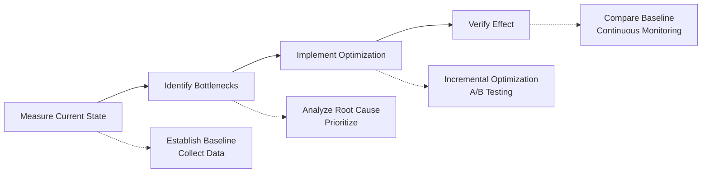

# L8-5: Performance Optimization Cases

> Learn performance optimization from real cases

## Section Overview

Through real performance optimization cases, learn how to systematically perform performance optimization. This lesson will analyze multiple typical scenarios and show before/after comparisons.

By the end of this lesson, you will learn:
- Performance problem diagnosis methods
- Optimization solution design
- Effect evaluation methods
- Establishing optimization workflows

---

## 1. Case 1: E-commerce Website Load Optimization

### 1.1 Problem Background

| Metric | Before Optimization |
|--------|--------------------|
| FCP | 3.2s |
| LCP | 5.8s |
| TTI | 8.5s |
| Initial JS | 2.1MB |

### 1.2 Optimization Measures

```javascript
// 1. Route-level code splitting
const ProductPage = lazy(() => import('./pages/Product'));
const CartPage = lazy(() => import('./pages/Cart'));

// 2. Image optimization
// Use WebP format
// Lazy load non-critical images
// Responsive images

// 3. Inline critical CSS
const criticalCSS = `
  /* Above-the-fold critical styles */
  .header { ... }
  .hero { ... }
`;

// 4. Preload critical resources
<link rel="preload" href="/fonts/main.woff2" as="font">
```

### 1.3 Optimization Effect

| Metric | After Optimization | Improvement |
|--------|-------------------|-------------|
| FCP | 1.1s | ↓ 66% |
| LCP | 2.3s | ↓ 60% |
| TTI | 3.2s | ↓ 62% |
| Initial JS | 450KB | ↓ 79% |

---

## 2. Case 2: API Response Optimization

### 2.1 Problem Background

```javascript
// Before optimization: Average response time 2.5s
app.get('/api/dashboard', async (req, res) => {
  const user = await getUser(req.userId);
  const orders = await getOrders(req.userId);
  const stats = await getStats(req.userId);
  const notifications = await getNotifications(req.userId);
  
  res.json({ user, orders, stats, notifications });
});
```

### 2.2 Optimization Measures

```javascript
// 1. Parallel queries
app.get('/api/dashboard', async (req, res) => {
  const [user, orders, stats, notifications] = await Promise.all([
    getUser(req.userId),
    getOrders(req.userId),
    getStats(req.userId),
    getNotifications(req.userId)
  ]);
  
  res.json({ user, orders, stats, notifications });
});

// 2. Add caching
const cache = new NodeCache({ stdTTL: 300 });

app.get('/api/dashboard', async (req, res) => {
  const cacheKey = `dashboard:${req.userId}`;
  let data = cache.get(cacheKey);
  
  if (!data) {
    data = await fetchDashboardData(req.userId);
    cache.set(cacheKey, data);
  }
  
  res.json(data);
});

// 3. Database index optimization
// CREATE INDEX idx_orders_user_date ON orders(user_id, created_at DESC);
```

### 2.3 Optimization Effect

| Metric | Value | Improvement |
|--------|-------|-------------|
| Average response time | 180ms | ↓ 93% |
| P95 response time | 350ms | - |
| Cache hit rate | 85% | - |

---

## 3. Case 3: Large Data List Optimization

### 3.1 Problem Background

```javascript
// Before optimization: Rendering 10000 items causes page lag
function DataTable({ data }) {
  return (
    <table>
      {data.map(item => (
        <tr key={item.id}>
          <td>{item.name}</td>
          <td>{item.value}</td>
        </tr>
      ))}
    </table>
  );
}
```

### 3.2 Optimization Measures

```javascript
// 1. Virtual list
import { FixedSizeList as List } from 'react-window';

function DataTable({ data }) {
  const Row = ({ index, style }) => (
    <div style={style}>
      {data[index].name} - {data[index].value}
    </div>
  );
  
  return (
    <List
      height={500}
      itemCount={data.length}
      itemSize={35}
    >
      {Row}
    </List>
  );
}

// 2. Paginated loading
function PaginatedTable({ data }) {
  const [page, setPage] = useState(1);
  const pageSize = 50;
  
  const paginatedData = data.slice((page - 1) * pageSize, page * pageSize);
  
  return (
    <>
      <Table data={paginatedData} />
      <Pagination 
        total={data.length} 
        pageSize={pageSize}
        onChange={setPage}
      />
    </>
  );
}
```

### 3.3 Optimization Effect

| Metric | After Optimization |
|--------|--------------------|
| First render time | 50ms |
| Memory usage | ↓ 90% |
| Scroll frame rate | 60fps |

---

## 4. Optimization Methodology

### 4.1 Optimization Process



### 4.2 Optimization Checklist

**Frontend Optimization:**
- [ ] Code splitting and lazy loading
- [ ] Image optimization (format, size, lazy loading)
- [ ] CSS optimization (critical CSS, remove unused)
- [ ] JS optimization (compression, Tree Shaking)
- [ ] Caching strategy

**Backend Optimization:**
- [ ] Database indexing
- [ ] Query optimization
- [ ] Caching strategy
- [ ] Asynchronous processing
- [ ] Connection pooling

---

## 5. Section Summary

### Key Points

1. **E-commerce Case**: Code splitting, image optimization, critical CSS

2. **API Case**: Parallel queries, caching, database indexing

3. **List Case**: Virtual list, paginated loading

4. **Optimization Process**: Measure → Identify → Optimize → Verify

### Chapter 8 Complete! 🎉

You have mastered the complete knowledge of performance optimization:
- L8-1: Performance Analysis Fundamentals
- L8-2: AI-Assisted Performance Analysis
- L8-3: Performance Optimization Strategies
- L8-4: Performance Monitoring and Alerting
- L8-5: Performance Optimization Cases

Next, we will enter **Chapter 9: Practical Projects**, comprehensively applying the knowledge learned to complete actual projects.

→ [9.1 Project Planning and Design](/tutorial/L9-1)
