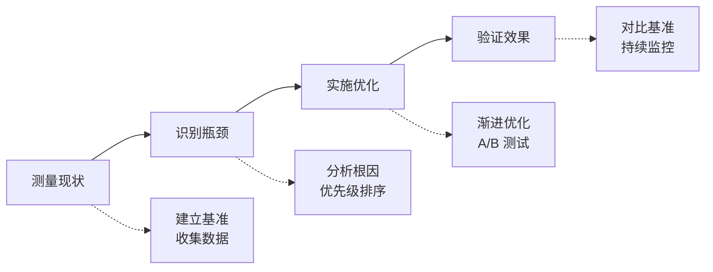

# L8-5: 性能优化案例

> 从真实案例中学习性能优化

## 本节导读

通过真实的性能优化案例，学习如何系统性地进行性能优化。本节课将分析多个典型场景，展示优化前后的对比。

通过本节课，你将学会：
- 性能问题诊断方法
- 优化方案设计
- 效果评估方法
- 建立优化流程

---

## 一、案例 1：电商网站加载优化

### 1.1 问题背景

| 指标 | 优化前 |
|------|--------|
| FCP | 3.2s |
| LCP | 5.8s |
| TTI | 8.5s |
| 首屏 JS | 2.1MB |

### 1.2 优化措施

```javascript
// 1. 路由级代码分割
const ProductPage = lazy(() => import('./pages/Product'));
const CartPage = lazy(() => import('./pages/Cart'));

// 2. 图片优化
// 使用 WebP 格式
// 懒加载非首屏图片
// 响应式图片

// 3. 关键 CSS 内联
const criticalCSS = `
  /* 首屏关键样式 */
  .header { ... }
  .hero { ... }
`;

// 4. 预加载关键资源
<link rel="preload" href="/fonts/main.woff2" as="font">
```

### 1.3 优化效果

| 指标 | 优化后 | 提升 |
|------|--------|------|
| FCP | 1.1s | ↓ 66% |
| LCP | 2.3s | ↓ 60% |
| TTI | 3.2s | ↓ 62% |
| 首屏 JS | 450KB | ↓ 79% |

---

## 二、案例 2：API 响应优化

### 2.1 问题背景

```javascript
// 优化前：平均响应时间 2.5s
app.get('/api/dashboard', async (req, res) => {
  const user = await getUser(req.userId);
  const orders = await getOrders(req.userId);
  const stats = await getStats(req.userId);
  const notifications = await getNotifications(req.userId);
  
  res.json({ user, orders, stats, notifications });
});
```

### 2.2 优化措施

```javascript
// 1. 并行查询
app.get('/api/dashboard', async (req, res) => {
  const [user, orders, stats, notifications] = await Promise.all([
    getUser(req.userId),
    getOrders(req.userId),
    getStats(req.userId),
    getNotifications(req.userId)
  ]);
  
  res.json({ user, orders, stats, notifications });
});

// 2. 添加缓存
const cache = new NodeCache({ stdTTL: 300 });

app.get('/api/dashboard', async (req, res) => {
  const cacheKey = `dashboard:${req.userId}`;
  let data = cache.get(cacheKey);
  
  if (!data) {
    data = await fetchDashboardData(req.userId);
    cache.set(cacheKey, data);
  }
  
  res.json(data);
});

// 3. 数据库索引优化
// CREATE INDEX idx_orders_user_date ON orders(user_id, created_at DESC);
```

### 2.3 优化效果

| 指标 | 数值 | 提升 |
|------|------|------|
| 平均响应时间 | 180ms | ↓ 93% |
| P95 响应时间 | 350ms | - |
| 缓存命中率 | 85% | - |

---

## 三、案例 3：大数据列表优化

### 3.1 问题背景

```javascript
// 优化前：渲染 10000 条数据，页面卡顿
function DataTable({ data }) {
  return (
    <table>
      {data.map(item => (
        <tr key={item.id}>
          <td>{item.name}</td>
          <td>{item.value}</td>
        </tr>
      ))}
    </table>
  );
}
```

### 3.2 优化措施

```javascript
// 1. 虚拟列表
import { FixedSizeList as List } from 'react-window';

function DataTable({ data }) {
  const Row = ({ index, style }) => (
    <div style={style}>
      {data[index].name} - {data[index].value}
    </div>
  );
  
  return (
    <List
      height={500}
      itemCount={data.length}
      itemSize={35}
    >
      {Row}
    </List>
  );
}

// 2. 分页加载
function PaginatedTable({ data }) {
  const [page, setPage] = useState(1);
  const pageSize = 50;
  
  const paginatedData = data.slice((page - 1) * pageSize, page * pageSize);
  
  return (
    <>
      <Table data={paginatedData} />
      <Pagination 
        total={data.length} 
        pageSize={pageSize}
        onChange={setPage}
      />
    </>
  );
}
```

### 3.3 优化效果

| 指标 | 优化后 |
|------|--------|
| 首屏渲染时间 | 50ms |
| 内存占用 | ↓ 90% |
| 滚动帧率 | 60fps |

---

## 四、优化方法论

### 4.1 优化流程



### 4.2 优化检查清单

**前端优化：**
- [ ] 代码分割和懒加载
- [ ] 图片优化（格式、大小、懒加载）
- [ ] CSS 优化（关键 CSS、移除未使用）
- [ ] JS 优化（压缩、Tree Shaking）
- [ ] 缓存策略

**后端优化：**
- [ ] 数据库索引
- [ ] 查询优化
- [ ] 缓存策略
- [ ] 异步处理
- [ ] 连接池

---

## 五、本节小结

### 核心要点

1. **电商案例**：代码分割、图片优化、关键 CSS

2. **API 案例**：并行查询、缓存、数据库索引

3. **列表案例**：虚拟列表、分页加载

4. **优化流程**：测量 → 识别 → 优化 → 验证

### 第八章完成！🎉

你已经掌握了性能优化的完整知识：
- L8-1: 性能分析基础
- L8-2: AI 辅助性能分析
- L8-3: 性能优化策略
- L8-4: 性能监控与告警
- L8-5: 性能优化案例

下一步，我们将进入 **第九章：实战项目**，综合运用所学知识完成实际项目。

→ [9.1 项目规划与设计](/tutorial/L9-1)
